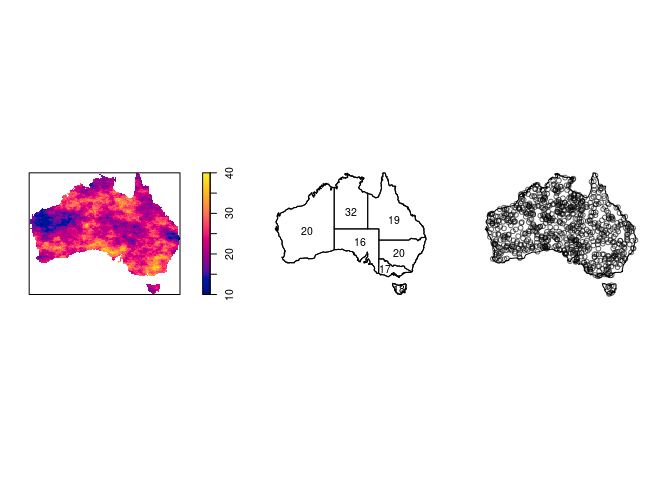

Notes for session 1
================
Adrian Baddeley and Ege Rubak
2019-07-15

Introduction
------------

*Spatial data*= data attributed to spatial locations

Three main types of spatial data:

-   spatial variable (field) eg temperature
-   regional aggregate data eg accident counts in each state
-   spatial point patterns eg locations of crimes/accidents



This workshop is about the analysis of *spatial point patterns*

We will use the `spatstat` package in `R`

``` r
library(spatstat)
```

Spatial point pattern terminology
---------------------------------

### Points

Spatial coordinates of locations

### Window

The window  is the spatial region where points were (or could have been) observed

### Covariates

Covariates are explanatory variables

Often a covariate is a function , \quad u \in W") defined at every spatial location.

Alternatively, other kinds of spatial data can be treated as explanatory data. Usually we need to translate them into spatial functions.

### Marks

Marks are attributes of the individual events or things, eg type of cell, type of accident

Marks are methodologically different from covariates: marks are part of the "response", not the "explanatory variable"

Software and data
-----------------

### Spatstat

``` r
library(spatstat)
```

A point pattern dataset is represented an object belonging to the class `"ppp"` (planar point pattern). Some datasets are included in the package:

``` r
plot(gordon)
```


``` r
class(gordon)
```

    ## [1] "ppp"

``` r
gordon
```

    ## Planar point pattern: 99 points
    ## window: polygonal boundary
    ## enclosing rectangle: [-26.408475, 26.408475] x [-36.32095, 36.32095] 
    ## metres

``` r
head(as.data.frame(gordon))
```

    ##              x        y
    ## 1  -6.19217799 29.89951
    ## 2 -12.95754899 23.24862
    ## 3 -11.57636899 15.81453
    ## 4  -0.09553099 24.72807
    ## 5   0.61446701 16.43510
    ## 6   0.61446701 15.30598

The window of observation for a point pattern can be extracted by:

``` r
W <- Window(gordon)
W
```

    ## window: polygonal boundary
    ## enclosing rectangle: [-26.408475, 26.408475] x [-36.32095, 36.32095] 
    ## metres

``` r
class(W)
```

    ## [1] "owin"

This is an object of class `"owin"` (observation window) representing a spatial region.

### Data file formats

Data may be provided in many different file formats

-   text file, CSV file
-   shapefile

Brief pointers on data wrangling

For convenience we will use datasets already installed in *spatstat*
