Notes for session 2
================
Adrian Baddeley and Ege Rubak
2019-07-02

Intensity
=========

Often the main objective is to study the "density" of points in the point pattern and to investigate any spatial variation in this density.

Point processes
---------------

In a statistical approach to data analysis, we think of the observed data as the outcome of a random process.

To analyse spatial point pattern data, we will regard the observed *point pattern*  as a realisation of a random *point process* .

It is helpful to visualise a point process as a collection ("ensemble") of many different possible outcomes. Here is one example:

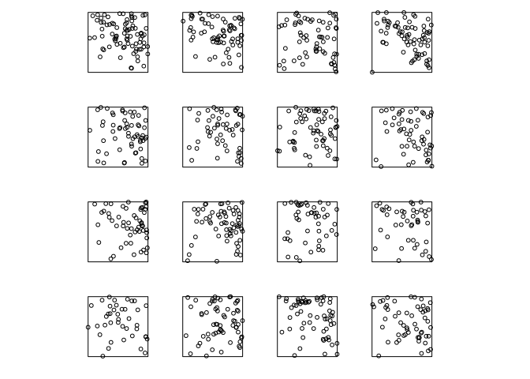

Intensity
---------

The *intensity* of a point process is the expected number of points per unit area. It may be a constant , or it may be spatially varying.

Intensity is an average, over all possible outcomes of the point process. We can visualise it by superimposing the ensemble of outcomes:


We will usually assume that the point process has an *intensity function* ") defined at every spatial location . Then ") is the spatially-varying expected number of points per unit area. It is formally defined to satisfy

![ E\[ n(B \\cap X) \] = \\int\_B \\lambda(u) \\, {\\rm d}u ](https://latex.codecogs.com/png.latex?%20E%5B%20n%28B%20%5Ccap%20X%29%20%5D%20%3D%20%5Cint_B%20%5Clambda%28u%29%20%5C%2C%20%7B%5Crm%20d%7Du%20 " E[ n(B \cap X) ] = \int_B \lambda(u) \, {\rm d}u ")

 for any region , where ") denotes the number of points falling in .

Intensity is closely related to probability density. If  is a Poisson point process with intensity function "), then each individual point inside  has probability density  = \lambda(u)/\Lambda_W"), where  \, {\rm d}u").

Nonparametric estimation
------------------------

Because of the close relationship between intensity and probability density, methods for nonparametric estimation of the intensity function are very similar to methods for density estimation.

### Nonparametric estimation of spatially-varying intensity

Given a point pattern  in a window  the kernel estimate of intensity is

 = \sum_{i=1}^n k(u - x_i) e(u, x_i)
")

 where ") is the smoothing kernel and ") is a correction for edge effects.

``` r
library(spatstat)
plot(japanesepines)
```


``` r
Z <- density(japanesepines, sigma=0.1)
plot(Z)
```


The command in `spatstat` to compute the kernel estimate of intensity is `density.ppp`, a method for the generic function `density`.

The argument `sigma` is the bandwidth of the smoothing kernel.


Bandwidth can be selected automatically:

``` r
bw.ppl(japanesepines)
```

    ##     sigma 
    ## 0.7071068

``` r
bw.diggle(japanesepines)
```

    ##      sigma 
    ## 0.05870841

``` r
bw.scott(japanesepines)
```

    ##   sigma.x   sigma.y 
    ## 0.1415691 0.1567939

### Nonparametric estimation of spatially-varying, mark-dependent intensity

A marked point pattern, with marks which are categorical values, effectively classifies the points into different types.

``` r
mucosa
```

    ## Marked planar point pattern: 965 points
    ## Multitype, with levels = ECL, other 
    ## window: rectangle = [0, 1] x [0, 0.81] units

``` r
plot(mucosa)
```

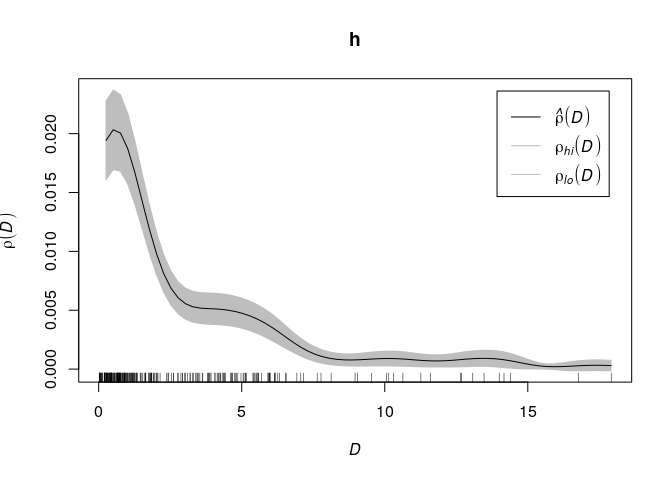

Extract the sub-patterns of points of each type:

``` r
M <- split(mucosa)
M
```

    ## Point pattern split by factor 
    ## 
    ## ECL:
    ## Planar point pattern: 89 points
    ## window: rectangle = [0, 1] x [0, 0.81] units
    ## 
    ## other:
    ## Planar point pattern: 876 points
    ## window: rectangle = [0, 1] x [0, 0.81] units

``` r
class(M)
```

    ## [1] "splitppp" "ppplist"  "solist"   "list"

``` r
plot(M)
```

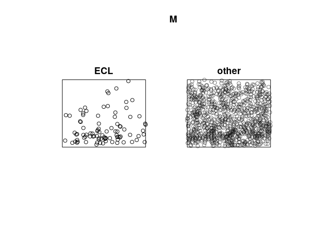

Apply kernel smoothing to each sub-pattern using `density.splitppp`:

``` r
B <- density(M, sigma=bw.ppl)
B
```

    ## List of pixel images
    ## 
    ## ECL:
    ## real-valued pixel image
    ## 128 x 128 pixel array (ny, nx)
    ## enclosing rectangle: [0, 1] x [0, 0.81] units
    ## 
    ## other:
    ## real-valued pixel image
    ## 128 x 128 pixel array (ny, nx)
    ## enclosing rectangle: [0, 1] x [0, 0.81] units

``` r
plot(B)
```


Suppose ") is the intensity function of the points of type , for . The intensity function of all points regardless of type is

 = \sum_{i=1}^m \lambda_i(u). ")

 Under reasonable assumptions, the probability that a random point at location  belongs to type  is

 = \frac{\lambda_i(u)}{\lambda_{\bullet}(u)}.
")

 We could calculate this by hand in `spatstat`:

``` r
lambdaECL <- B[["ECL"]]
lambdaOther <- B[["other"]]
lambdaDot <- lambdaECL + lambdaOther
pECL <- lambdaECL/lambdaDot
pOther <- lambdaOther/lambdaDot
plot(pECL)
```


These calculations are automated in the function `relrisk` (relative risk):

``` r
V <- relrisk(mucosa, bw.ppl, casecontrol=FALSE)
plot(V, main="")
```

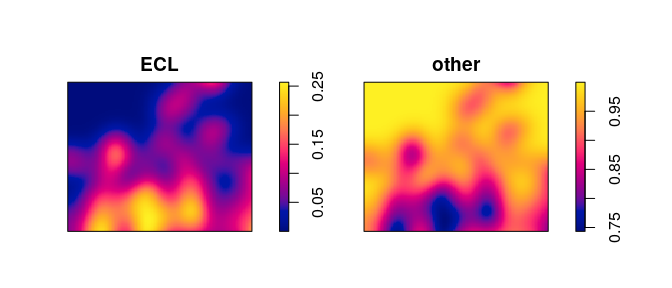

Bandwidth selection for the ratio is different from bandwidth selection for the intensity. We recommend using the special algorithm `bw.relrisk`:

``` r
bw.relrisk(mucosa)
```

    ##     sigma 
    ## 0.1282096

``` r
Vr <- relrisk(mucosa, bw.relrisk, casecontrol=FALSE)
plot(Vr, main="")
```

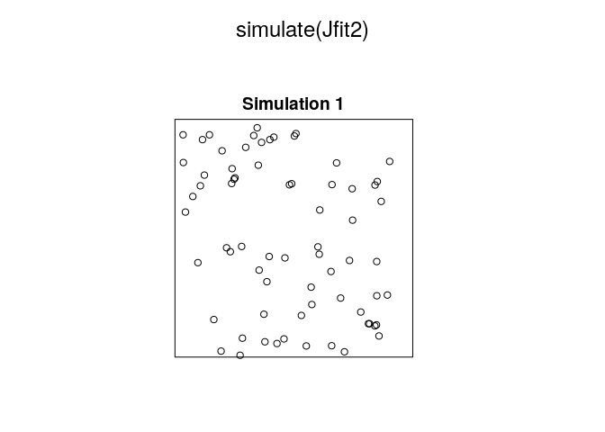

### Nonparametric estimation of intensity depending on a covariate

In some applications we believe that the intensity depends on a spatial covariate , in the form

 = \rho(Z(u))
")

 where ") is an unknown function which we want to estimate. A nonparametric estimator of  is

 = \frac{\sum_{i=1}^n k(Z(x_i) - z)}{\int_W k(Z(u) - z) \, {\rm d} u}
")

 where ") is a one-dimensional smoothing kernel. This is computed by `rhohat`.

*Example*: mucosa data, enterochromaffin-like cells (ECL)

``` r
E <- split(mucosa)$ECL
plot(E)
```

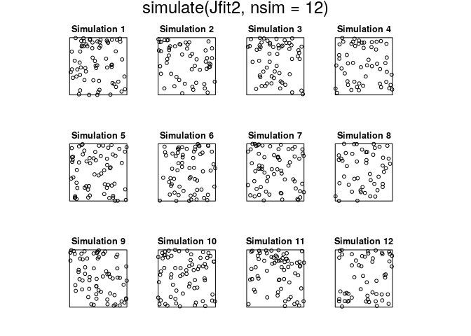

The wall of the gut is at the bottom of the picture. Cell density appears to decline as we go further away from the wall. Use the string `"y"` to refer to the  coordinate:

``` r
g <- rhohat(E, "y")
plot(g)
```

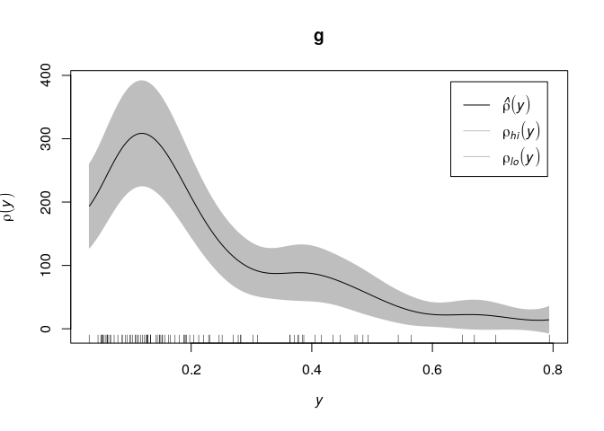

*Example*: Murchison gold survey.

``` r
X <- murchison$gold
L <- murchison$faults
X <- rescale(X, 1000, "km")
L <- rescale(L, 1000, "km")
D <- distfun(L)
plot(solist(gold=X, faults=L, distance=D), main="", equal.scales=TRUE)
```

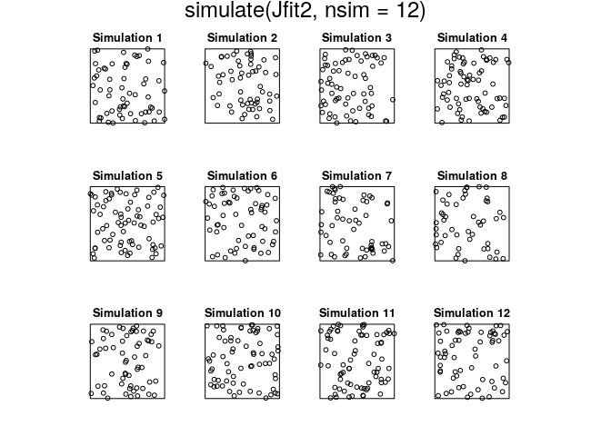

Gold deposits are frequently found near a geological fault line. Here we converted the fault line pattern into a spatial covariate

 = \mbox{ distance from } u \mbox{ to nearest fault }
")

``` r
h <- rhohat(X, D)
plot(h)
```

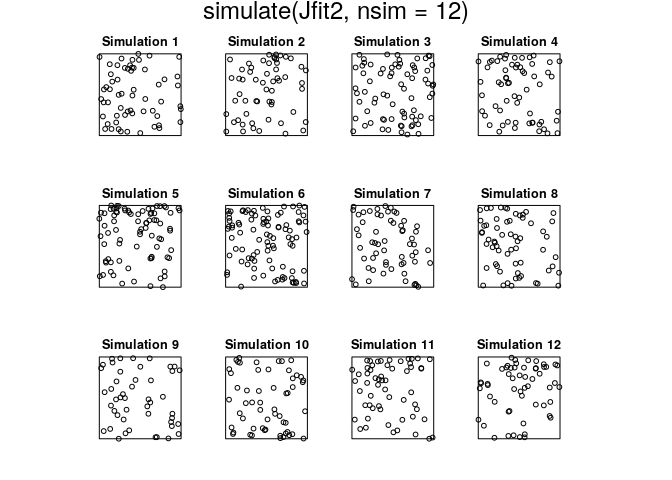

Parametric modelling
--------------------

We can formulate a parametric model for the intensity and fit it to the point pattern data, using the `spatstat` function `ppm` (point process model).

### Loglinear model for intensity

In its simplest form, `ppm` fits a *Poisson point process model* to the point pattern data by maximum likelihood.

A Poisson point process is completely specified by its intensity function. So the procedure for formulating a Poisson model is simply to write a mathematical expression for the intensity function.

In `ppm` the intensity is assumed to be a **loglinear** function of the **parameters**. That is,

 = \beta_1 Z_1(u) + \ldots + \beta_p Z_p(u)")

 where  are parameters to be estimated, and  are spatial covariates.

To fit this model to a point pattern dataset `X`, we type

``` r
ppm(X ~ Z1 + Z2 + .. Zp)
```

where `Z1, Z2, ..., Zp` are pixel images or functions.

Important notes:

1.  The model is expressed in terms of the **log** of the intensity.

2.  The covariates , \ldots, Z_p(u)") (called the "canonical covariates") can be anything; they are not necessarily the same as the original variables that we were given; they could be transformations and combinations of the original variables.

### Fit by maximum likelihood

The Poisson process with intensity function "), controlled by a parameter vector , has log-likelihood

 = \sum_{i=1}^n \log \lambda_\theta(x_i)
                    - \int_W \lambda_\theta(u) \, {\rm d} u.
")

 The value of  which maximises ") is taken as the parameter estimate .

From  we can compute the fitted intensity  = \lambda_{\hat\theta}(u)") and hence we can generate simulated realisations.

Using the likelihood we are able to compute confidence intervals, perform analysis of deviance, conduct hypothesis tests, etc.

*Example*: Murchison gold data

``` r
fit <- ppm(X ~ D)
coef(fit)
```

    ## (Intercept)           D 
    ##  -4.3412775  -0.2607664

``` r
confint(fit)
```

    ##                  2.5 %     97.5 %
    ## (Intercept) -4.5089771 -4.1735779
    ## D           -0.3003339 -0.2211988

``` r
anova(fit, test="Chi")
```

    ## Analysis of Deviance Table
    ## Terms added sequentially (first to last)
    ## 
    ##      Df Deviance Npar  Pr(>Chi)    
    ## NULL                1              
    ## D     1   590.92    2 < 2.2e-16 ***
    ## ---
    ## Signif. codes:  0 '***' 0.001 '**' 0.01 '*' 0.05 '.' 0.1 ' ' 1

``` r
plot(predict(fit))
```


``` r
plot(effectfun(fit, "D"), xlim=c(0, 20))
```

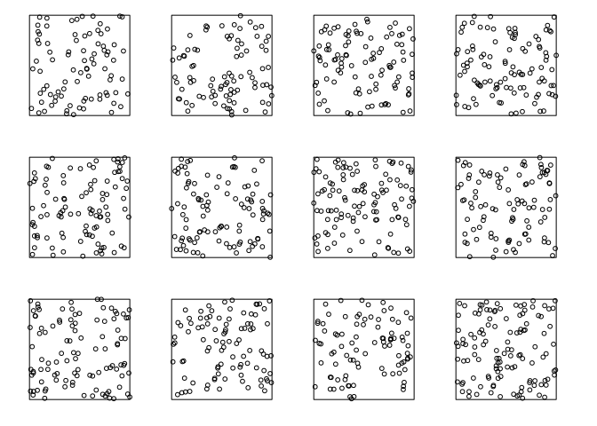

``` r
plot(simulate(fit))
plot(L, add=TRUE, col="blue")
```

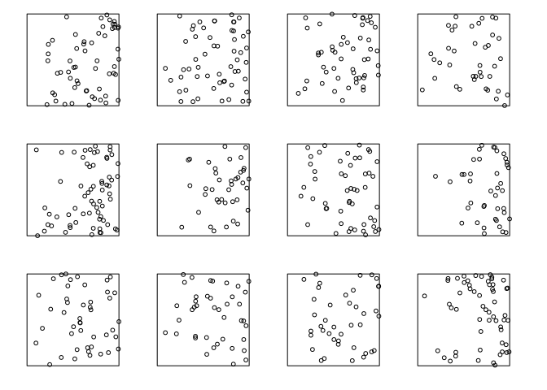

The symnbols `x, y` refer to the Cartesian coordinates, and can be used to model spatial variation in the intensity when no other covariates are available:

``` r
Jfit <- ppm(japanesepines ~ x + y)
Jfit
```

    ## Nonstationary Poisson process
    ## 
    ## Log intensity:  ~x + y
    ## 
    ## Fitted trend coefficients:
    ## (Intercept)           x           y 
    ##   4.0670790  -0.2349641   0.4296171 
    ## 
    ##               Estimate      S.E.    CI95.lo   CI95.hi Ztest       Zval
    ## (Intercept)  4.0670790 0.3341802  3.4120978 4.7220602   *** 12.1703167
    ## x           -0.2349641 0.4305456 -1.0788181 0.6088898       -0.5457357
    ## y            0.4296171 0.4318102 -0.4167154 1.2759495        0.9949211

``` r
confint(Jfit)
```

    ##                  2.5 %    97.5 %
    ## (Intercept)  3.4120978 4.7220602
    ## x           -1.0788181 0.6088898
    ## y           -0.4167154 1.2759495

``` r
Jfit2 <- ppm(japanesepines ~ polynom(x,y,2))
Jfit2
```

    ## Nonstationary Poisson process
    ## 
    ## Log intensity:  ~x + y + I(x^2) + I(x * y) + I(y^2)
    ## 
    ## Fitted trend coefficients:
    ## (Intercept)           x           y      I(x^2)    I(x * y)      I(y^2) 
    ##   4.0645501   1.1436854  -1.5613621  -0.7490094  -1.2009245   2.5061569 
    ## 
    ##               Estimate      S.E.    CI95.lo  CI95.hi Ztest       Zval
    ## (Intercept)  4.0645501 0.6670766  2.7571041 5.371996   ***  6.0930788
    ## x            1.1436854 1.9589569 -2.6957995 4.983170        0.5838237
    ## y           -1.5613621 1.8738722 -5.2340841 2.111360       -0.8332277
    ## I(x^2)      -0.7490094 1.7060242 -4.0927554 2.594737       -0.4390380
    ## I(x * y)    -1.2009245 1.4268186 -3.9974376 1.595589       -0.8416799
    ## I(y^2)       2.5061569 1.6013679 -0.6324664 5.644780        1.5650101

``` r
plot(predict(Jfit2))
```

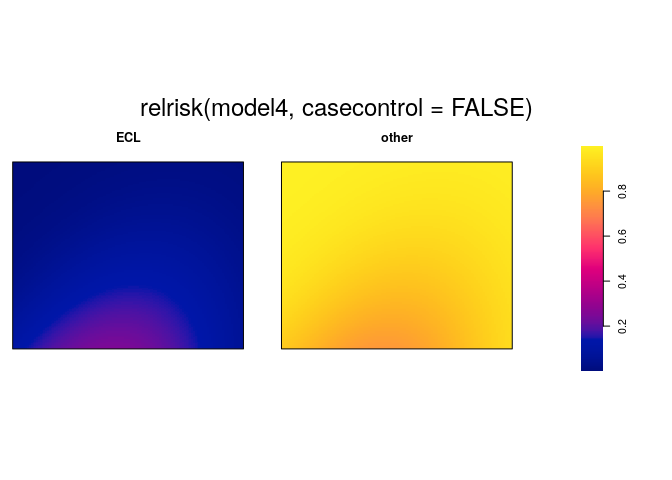

``` r
anova(Jfit, Jfit2, test="Chi")
```

    ## Analysis of Deviance Table
    ## 
    ## Model 1: ~x + y   Poisson
    ## Model 2: ~x + y + I(x^2) + I(x * y) + I(y^2)      Poisson
    ##   Npar Df Deviance Pr(>Chi)
    ## 1    3                     
    ## 2    6  3   3.3851    0.336

``` r
step(Jfit2)
```

    ## Start:  AIC=-405.35
    ## ~x + y + I(x^2) + I(x * y) + I(y^2)
    ## 
    ##            Df     AIC
    ## - I(x^2)    1 -407.15
    ## - x         1 -407.00
    ## - y         1 -406.67
    ## - I(x * y)  1 -406.63
    ## <none>        -405.35
    ## - I(y^2)    1 -404.97
    ## 
    ## Step:  AIC=-407.15
    ## ~x + y + I(x * y) + I(y^2)
    ## 
    ##            Df     AIC
    ## - x         1 -408.96
    ## - I(x * y)  1 -408.47
    ## - y         1 -408.45
    ## <none>        -407.15
    ## - I(y^2)    1 -406.77
    ## 
    ## Step:  AIC=-408.96
    ## ~y + I(x * y) + I(y^2)
    ## 
    ##            Df     AIC
    ## - I(x * y)  1 -410.17
    ## - y         1 -409.78
    ## <none>        -408.96
    ## - I(y^2)    1 -408.48
    ## 
    ## Step:  AIC=-410.17
    ## ~y + I(y^2)
    ## 
    ##          Df     AIC
    ## - y       1 -410.51
    ## <none>      -410.17
    ## - I(y^2)  1 -409.66
    ## 
    ## Step:  AIC=-410.51
    ## ~I(y^2)
    ## 
    ##          Df     AIC
    ## - I(y^2)  1 -410.67
    ## <none>      -410.51
    ## 
    ## Step:  AIC=-410.67
    ## ~1

    ## Stationary Poisson process
    ## Intensity: 65
    ##             Estimate      S.E.  CI95.lo  CI95.hi Ztest     Zval
    ## log(lambda) 4.174387 0.1240347 3.931284 4.417491   *** 33.65499

``` r
plot(simulate(Jfit2))
```

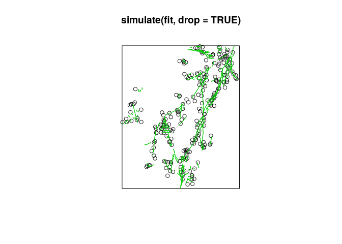

``` r
plot(simulate(Jfit2, nsim=12))
```

    ## Generating 12 simulated patterns ...1, 2, 3, 4, 5, 6, 7, 8, 9, 10, 11,  12.

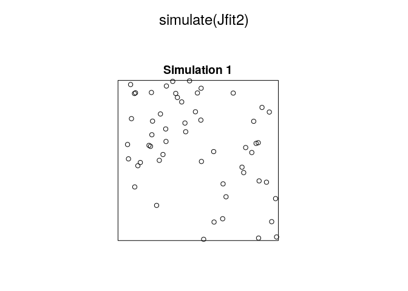

### Intensity depends on marks

``` r
model0 <- ppm(mucosa ~ marks)
model0
```

    ## Stationary multitype Poisson process
    ## 
    ## Possible marks: 'ECL' and 'other'
    ## 
    ## Log intensity:  ~marks
    ## 
    ## Intensities:
    ##   beta_ECL beta_other 
    ##   109.8765  1081.4815 
    ## 
    ##             Estimate      S.E.  CI95.lo  CI95.hi Ztest     Zval
    ## (Intercept) 4.699357 0.1059998 4.491602 4.907113   *** 44.33365
    ## marksother  2.286730 0.1112542 2.068675 2.504784   *** 20.55409

``` r
coef(model0)
```

    ## (Intercept)  marksother 
    ##    4.699357    2.286730

``` r
plot(predict(model0), equal.ribbon=TRUE)
```

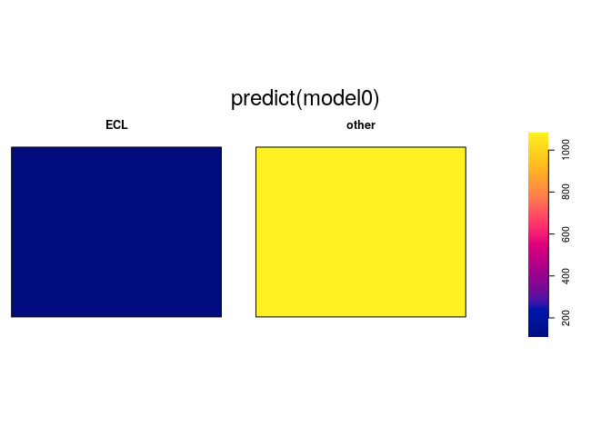

``` r
model1 <- ppm(mucosa ~ marks + y)
model1
```

    ## Nonstationary multitype Poisson process
    ## 
    ## Possible marks: 'ECL' and 'other'
    ## 
    ## Log intensity:  ~marks + y
    ## 
    ## Fitted trend coefficients:
    ## (Intercept)  marksother           y 
    ##    5.131273    2.286730   -1.156055 
    ## 
    ##              Estimate      S.E.   CI95.lo    CI95.hi Ztest      Zval
    ## (Intercept)  5.131273 0.1164479  4.903039  5.3595066   *** 44.064966
    ## marksother   2.286730 0.1112542  2.068675  2.5047840   *** 20.554089
    ## y           -1.156055 0.1406821 -1.431787 -0.8803236   *** -8.217504

``` r
coef(model1)
```

    ## (Intercept)  marksother           y 
    ##    5.131273    2.286730   -1.156055

``` r
plot(predict(model1))
```

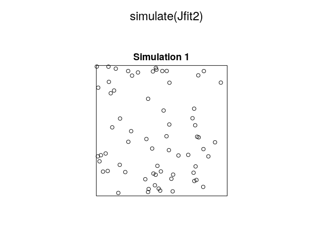

``` r
model2 <- ppm(mucosa ~ marks * y)
model2
```

    ## Nonstationary multitype Poisson process
    ## 
    ## Possible marks: 'ECL' and 'other'
    ## 
    ## Log intensity:  ~marks * y
    ## 
    ## Fitted trend coefficients:
    ##  (Intercept)   marksother            y marksother:y 
    ##     5.884603     1.452251    -3.862202     2.938790 
    ## 
    ##               Estimate      S.E.   CI95.lo   CI95.hi Ztest      Zval
    ## (Intercept)   5.884603 0.1635842  5.563984  6.205222   *** 35.972936
    ## marksother    1.452251 0.1749458  1.109364  1.795139   ***  8.301149
    ## y            -3.862202 0.5616953 -4.963104 -2.761299   *** -6.875973
    ## marksother:y  2.938790 0.5804890  1.801053  4.076528   ***  5.062611

``` r
coef(model2)
```

    ##  (Intercept)   marksother            y marksother:y 
    ##     5.884603     1.452251    -3.862202     2.938790

``` r
plot(predict(model2))
```

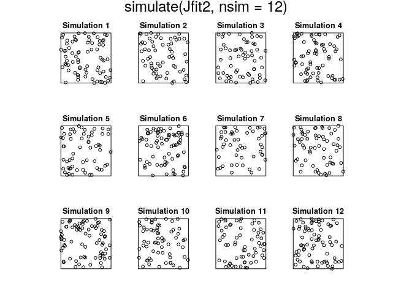

``` r
model1xy <- ppm(mucosa ~ marks + x + y)
model1xy
```

    ## Nonstationary multitype Poisson process
    ## 
    ## Possible marks: 'ECL' and 'other'
    ## 
    ## Log intensity:  ~marks + x + y
    ## 
    ## Fitted trend coefficients:
    ##  (Intercept)   marksother            x            y 
    ##  5.135026706  2.286729721 -0.007512035 -1.156055806 
    ## 
    ##                 Estimate      S.E.    CI95.lo    CI95.hi Ztest       Zval
    ## (Intercept)  5.135026706 0.1290806  4.8820333  5.3880201   *** 39.7815429
    ## marksother   2.286729721 0.1112542  2.0686754  2.5047840   *** 20.5540892
    ## x           -0.007512035 0.1115200 -0.2260873  0.2110632       -0.0673604
    ## y           -1.156055806 0.1406820 -1.4317876 -0.8803241   *** -8.2175076

``` r
coef(model1xy)
```

    ##  (Intercept)   marksother            x            y 
    ##  5.135026706  2.286729721 -0.007512035 -1.156055806

``` r
plot(predict(model1xy))
```


``` r
model2xy <- ppm(mucosa ~ marks * (x + y))
model2xy
```

    ## Nonstationary multitype Poisson process
    ## 
    ## Possible marks: 'ECL' and 'other'
    ## 
    ## Log intensity:  ~marks * (x + y)
    ## 
    ## Fitted trend coefficients:
    ##  (Intercept)   marksother            x            y marksother:x 
    ##   5.85306325   1.49110635   0.06275125  -3.86220183  -0.07739871 
    ## marksother:y 
    ##   2.93878953 
    ## 
    ##                 Estimate      S.E.    CI95.lo    CI95.hi Ztest       Zval
    ## (Intercept)   5.85306325 0.2473601  5.3682464  6.3378801   *** 23.6621186
    ## marksother    1.49110635 0.2616142  0.9783520  2.0038607   ***  5.6996392
    ## x             0.06275125 0.3672459 -0.6570374  0.7825399        0.1708699
    ## y            -3.86220183 0.5616962 -4.9631062 -2.7612975   *** -6.8759620
    ## marksother:x -0.07739871 0.3854477 -0.8328623  0.6780649       -0.2008021
    ## marksother:y  2.93878953 0.5804899  1.8010502  4.0765289   ***  5.0626022

``` r
coef(model2xy)
```

    ##  (Intercept)   marksother            x            y marksother:x 
    ##   5.85306325   1.49110635   0.06275125  -3.86220183  -0.07739871 
    ## marksother:y 
    ##   2.93878953

``` r
plot(predict(model2xy))
```

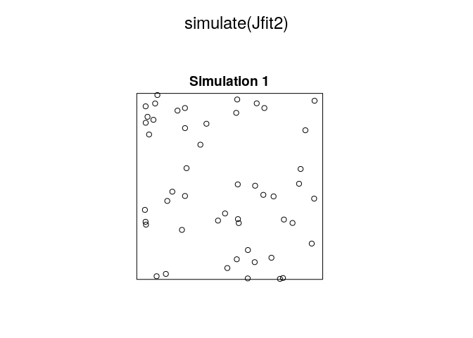

``` r
model3 <- ppm(mucosa ~ marks + polynom(x, y, 2))
model3
```

    ## Nonstationary multitype Poisson process
    ## 
    ## Possible marks: 'ECL' and 'other'
    ## 
    ## Log intensity:  ~marks + (x + y + I(x^2) + I(x * y) + I(y^2))
    ## 
    ## Fitted trend coefficients:
    ## (Intercept)  marksother           x           y      I(x^2)    I(x * y) 
    ##   4.8407551   2.2867297   0.2828123   0.8046386  -0.2449076  -0.1328756 
    ##      I(y^2) 
    ##  -2.5066916 
    ## 
    ##               Estimate      S.E.    CI95.lo    CI95.hi Ztest       Zval
    ## (Intercept)  4.8407551 0.1865057  4.4752107  5.2062995   *** 25.9550007
    ## marksother   2.2867297 0.1112542  2.0686754  2.5047840   *** 20.5540892
    ## x            0.2828123 0.4840067 -0.6658233  1.2314479        0.5843149
    ## y            0.8046386 0.6087936 -0.3885748  1.9978521        1.3216937
    ## I(x^2)      -0.2449076 0.4346487 -1.0968034  0.6069882       -0.5634611
    ## I(x * y)    -0.1328756 0.5195314 -1.1511385  0.8853873       -0.2557605
    ## I(y^2)      -2.5066916 0.7025926 -3.8837479 -1.1296354   *** -3.5677739

``` r
coef(model3)
```

    ## (Intercept)  marksother           x           y      I(x^2)    I(x * y) 
    ##   4.8407551   2.2867297   0.2828123   0.8046386  -0.2449076  -0.1328756 
    ##      I(y^2) 
    ##  -2.5066916

``` r
plot(predict(model3))
```

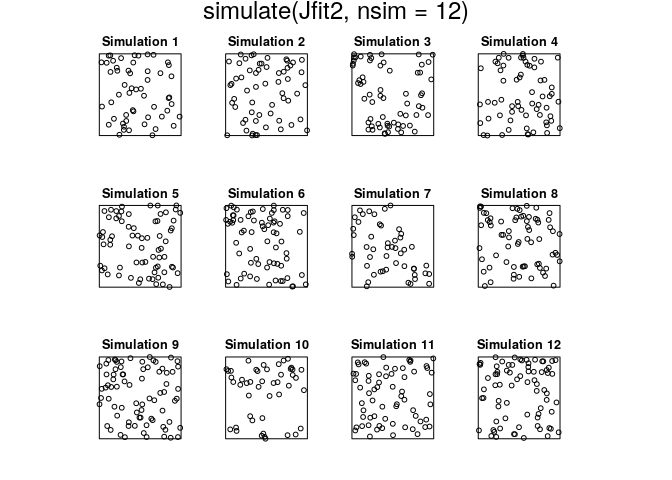

``` r
model4 <- ppm(mucosa ~ marks * polynom(x,y,2))
model4
```

    ## Nonstationary multitype Poisson process
    ## 
    ## Possible marks: 'ECL' and 'other'
    ## 
    ## Log intensity:  ~marks * (x + y + I(x^2) + I(x * y) + I(y^2))
    ## 
    ## Fitted trend coefficients:
    ##         (Intercept)          marksother                   x 
    ##            5.018632            2.040831            4.310737 
    ##                   y              I(x^2)            I(x * y) 
    ##           -2.261047           -4.905847            3.086670 
    ##              I(y^2)        marksother:x        marksother:y 
    ##           -5.199005           -4.388268            3.579736 
    ##   marksother:I(x^2) marksother:I(x * y)   marksother:I(y^2) 
    ##            5.059764           -3.342710            2.439852 
    ## 
    ##                      Estimate      S.E.     CI95.lo    CI95.hi Ztest
    ## (Intercept)          5.018632 0.5006414   4.0373924  5.9998706   ***
    ## marksother           2.040831 0.5278293   1.0063043  3.0753570   ***
    ## x                    4.310737 1.7516879   0.8774918  7.7439820     *
    ## y                   -2.261047 2.2251226  -6.6222072  2.1001133      
    ## I(x^2)              -4.905847 1.6650184  -8.1692227 -1.6424705    **
    ## I(x * y)             3.086670 2.6191912  -2.0468503  8.2201905      
    ## I(y^2)              -5.199005 3.0833891 -11.2423363  0.8443271      
    ## marksother:x        -4.388268 1.8233568  -7.9619815 -0.8145540     *
    ## marksother:y         3.579736 2.3165955  -0.9607074  8.1201802      
    ## marksother:I(x^2)    5.059764 1.7252514   1.6783335  8.4411947    **
    ## marksother:I(x * y) -3.342710 2.6736718  -8.5830101  1.8975907      
    ## marksother:I(y^2)    2.439852 3.1699025  -3.7730426  8.6527470      
    ##                           Zval
    ## (Intercept)         10.0244036
    ## marksother           3.8664599
    ## x                    2.4609047
    ## y                   -1.0161449
    ## I(x^2)              -2.9464219
    ## I(x * y)             1.1784822
    ## I(y^2)              -1.6861331
    ## marksother:x        -2.4066971
    ## marksother:y         1.5452574
    ## marksother:I(x^2)    2.9327692
    ## marksother:I(x * y) -1.2502319
    ## marksother:I(y^2)    0.7696931

``` r
coef(model4)
```

    ##         (Intercept)          marksother                   x 
    ##            5.018632            2.040831            4.310737 
    ##                   y              I(x^2)            I(x * y) 
    ##           -2.261047           -4.905847            3.086670 
    ##              I(y^2)        marksother:x        marksother:y 
    ##           -5.199005           -4.388268            3.579736 
    ##   marksother:I(x^2) marksother:I(x * y)   marksother:I(y^2) 
    ##            5.059764           -3.342710            2.439852

``` r
plot(predict(model4))
```

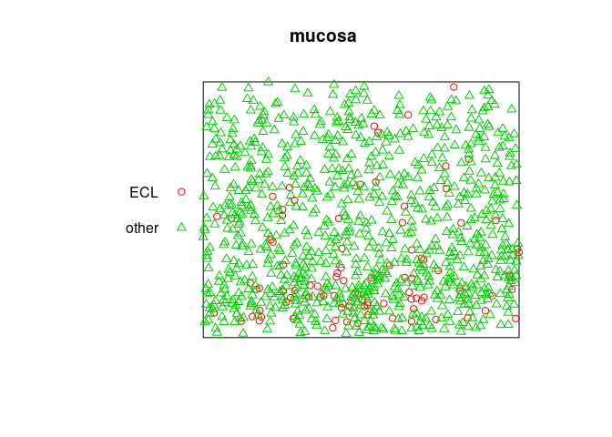

*relrisk.ppm*

``` r
plot(relrisk(model4, casecontrol=FALSE))
```


``` r
plot(relrisk(model3, casecontrol=FALSE), equal.ribbon=TRUE)
```

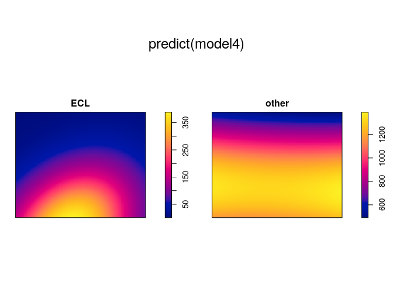
