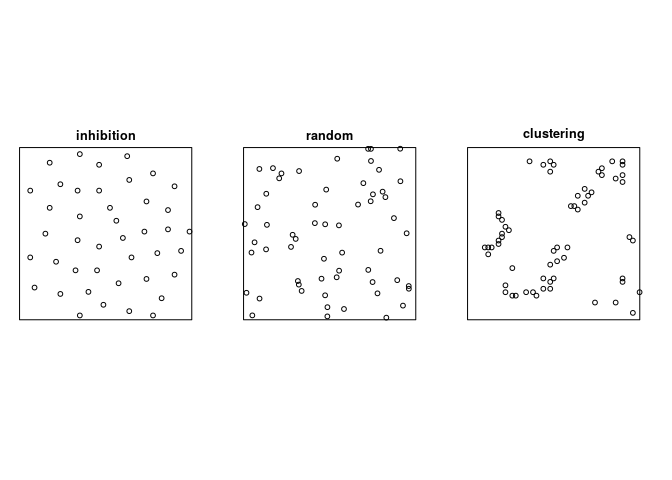
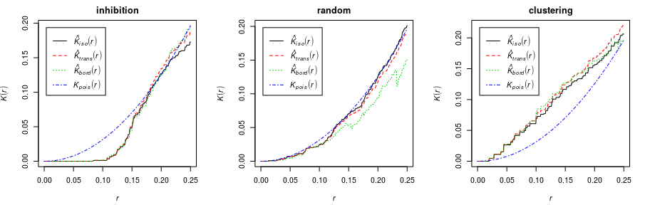
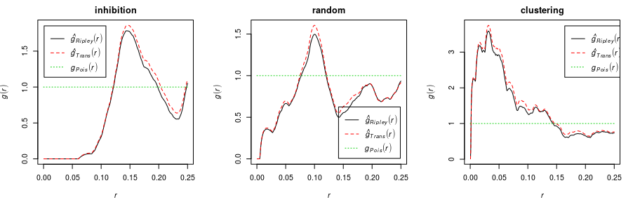
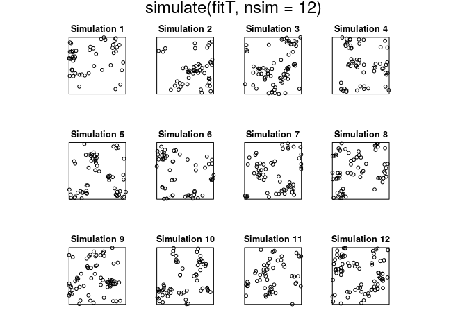
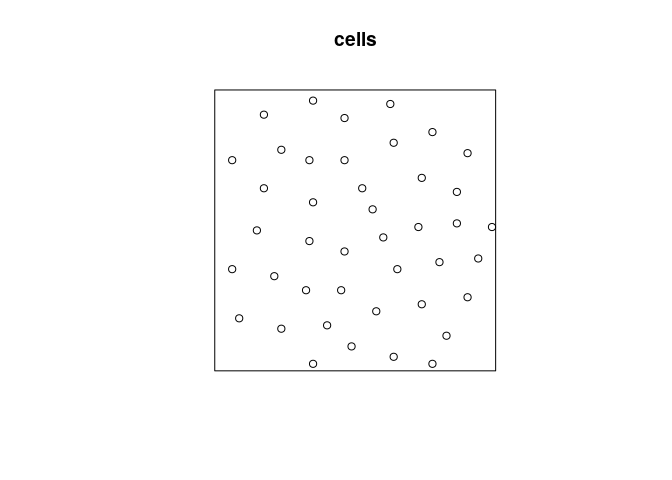
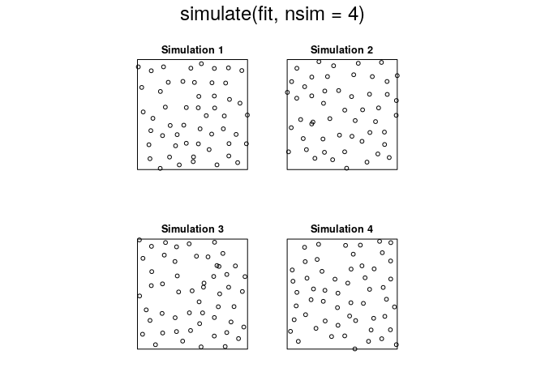
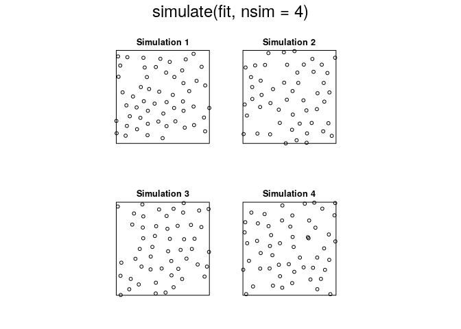
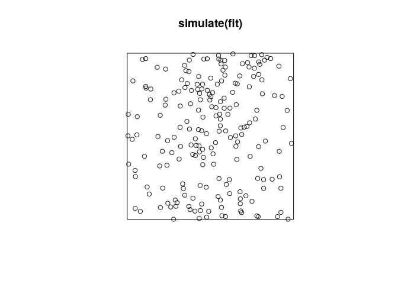

Notes for session 3
================
Adrian Baddeley and Ege Rubak
2019-07-03

Dependence between points
=========================



Exploratory tools
-----------------

### K-function



### pair correlation function



Explicit Models for clustered data
----------------------------------

``` r
plot(redwood)
```


``` r
fitT <- kppm(redwood ~ 1, "Thomas")
fitT
```

    ## Stationary cluster point process model
    ## Fitted to point pattern dataset 'redwood'
    ## Fitted by minimum contrast
    ##  Summary statistic: K-function
    ## 
    ## Uniform intensity:   62
    ## 
    ## Cluster model: Thomas process
    ## Fitted cluster parameters:
    ##      kappa      scale 
    ## 23.5511449  0.0470461 
    ## Mean cluster size:  2.632568 points

``` r
plot(simulate(fitT, nsim=12))
```

    ## Generating 12 simulations... 1, 2, 3, 4, 5, 6, 7, 8, 9, 10, 11,  12.
    ## Done.



``` r
kppm(redwood ~ x+y, "Thomas")
```

    ## Inhomogeneous cluster point process model
    ## Fitted to point pattern dataset 'redwood'
    ## Fitted by minimum contrast
    ##  Summary statistic: inhomogeneous K-function
    ## 
    ## Log intensity:  ~x + y
    ## 
    ## Fitted trend coefficients:
    ## (Intercept)           x           y 
    ##  3.95144951  0.29770284 -0.04607577 
    ## 
    ## Cluster model: Thomas process
    ## Fitted cluster parameters:
    ##       kappa       scale 
    ## 22.97116104  0.04625136 
    ## Mean cluster size:  [pixel image]

``` r
kppm(redwood ~ x+y, "LGCP")
```

    ## Inhomogeneous Cox point process model
    ## Fitted to point pattern dataset 'redwood'
    ## Fitted by minimum contrast
    ##  Summary statistic: inhomogeneous K-function
    ## 
    ## Log intensity:  ~x + y
    ## 
    ## Fitted trend coefficients:
    ## (Intercept)           x           y 
    ##  3.95144951  0.29770284 -0.04607577 
    ## 
    ## Cox model: log-Gaussian Cox process
    ##  Covariance model: exponential
    ## Fitted covariance parameters:
    ##        var      scale 
    ## 1.09380346 0.09796466 
    ## Fitted mean of log of random intensity: [pixel image]

Models for inhibited data
-------------------------

``` r
plot(cells)
```


``` r
jp <- residualspaper$Fig1
plot(jp)
```



### Gibbs models

``` r
ppm(cells~ 1, Hardcore())
```

    ## Stationary Hard core process
    ## 
    ## First order term:  beta = 282.7782
    ## 
    ## Hard core distance:  0.08168525
    ## 
    ## For standard errors, type coef(summary(x))

``` r
minnndist(cells)
```

    ## [1] 0.08363014

``` r
ppm(cells ~ 1, Strauss(0.1))
```

    ## Stationary Strauss process
    ## 
    ## First order term:  beta = 1138.136
    ## 
    ## Interaction distance:    0.1
    ## Fitted interaction parameter gamma:   0.0050219
    ## 
    ## Relevant coefficients:
    ## Interaction 
    ##    -5.29395 
    ## 
    ## For standard errors, type coef(summary(x))

``` r
fit <- ppm(cells ~ 1, Strauss(0.1))
plot(simulate(fit, nsim=4))
```

    ## Generating 4 simulated patterns ...1, 2, 3,  4.



``` r
plot(pcfinhom(jp))
```



``` r
minnndist(jp)
```

    ## [1] 0.1410937

``` r
ppm(jp ~ x+y, Strauss(0.2))
```

    ## Nonstationary Strauss process
    ## 
    ## Log trend:  ~x + y
    ## 
    ## Fitted trend coefficients:
    ## (Intercept)           x           y 
    ## 0.679292879 0.006806174 0.024664271 
    ## 
    ## Interaction distance:    0.2
    ## Fitted interaction parameter gamma:   0.6367406
    ## 
    ## Relevant coefficients:
    ## Interaction 
    ##   -0.451393 
    ## 
    ## For standard errors, type coef(summary(x))

``` r
ppm(jp ~ x+y, Strauss(0.5))
```

    ## Nonstationary Strauss process
    ## 
    ## Log trend:  ~x + y
    ## 
    ## Fitted trend coefficients:
    ##  (Intercept)            x            y 
    ##  0.364642729 -0.004808391  0.033863194 
    ## 
    ## Interaction distance:    0.5
    ## Fitted interaction parameter gamma:   1.1799626
    ## 
    ## Relevant coefficients:
    ## Interaction 
    ##   0.1654827 
    ## 
    ## For standard errors, type coef(summary(x))
    ## 
    ## *** Model is not valid ***
    ## *** Interaction parameters are outside valid range ***

### Determinantal point process models

``` r
dppm(jp ~ x+y, dppGauss)
```

    ## Inhomogeneous determinantal point process model
    ## Fitted to point pattern dataset 'jp'
    ## Fitted by minimum contrast
    ##  Summary statistic: inhomogeneous K-function
    ## 
    ## Log intensity:  ~x + y
    ## 
    ## Fitted trend coefficients:
    ## (Intercept)           x           y 
    ## 0.591839808 0.014329205 0.009643885 
    ## 
    ## Fitted DPP model:
    ## Gaussian determinantal point process model
    ## The parameters are: lambda = an image, alpha = 0.06402, d = 2
    ## The parameter lambda specifies the intensity of the process.
    ## The parameter d specifies the dimension of the state space.

``` r
fit <- dppm(jp ~ polynom(x,y,2),
            dppMatern,
        statistic="pcf", statargs=list(stoyan=0.2))
```

    ## Warning: Some values of the empirical function 'pcf' were infinite or NA.
    ## Range of r values was reset to [0.0048828125, 2.5]

``` r
plot(predict(fit))      
```


``` r
plot(simulate(fit))
```


