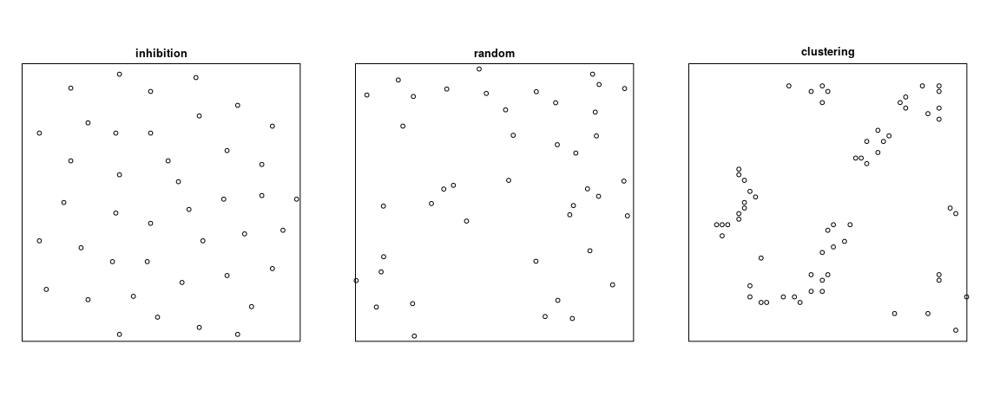
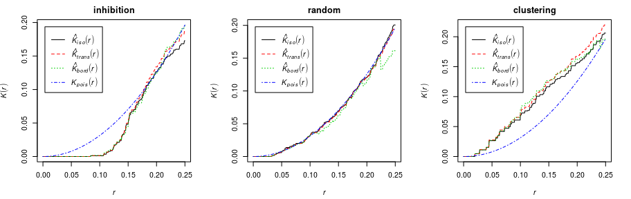
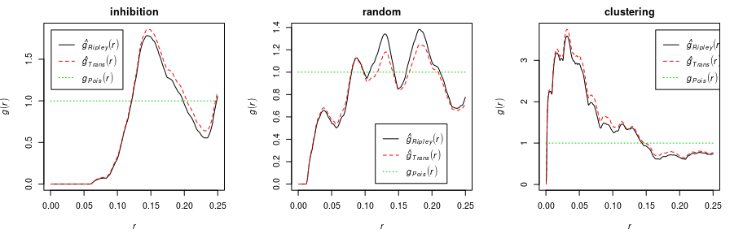
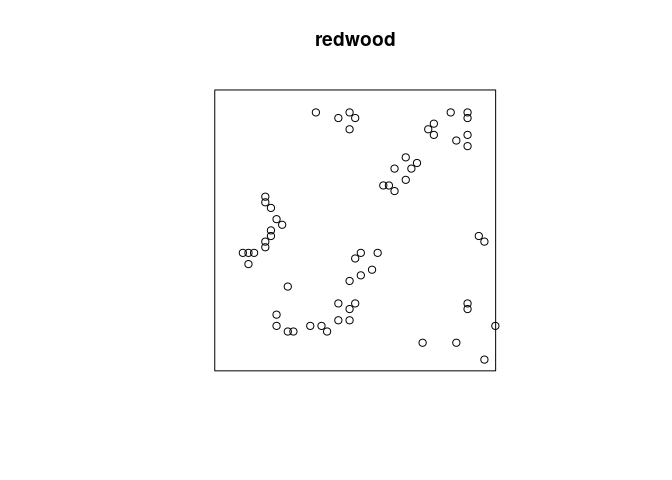
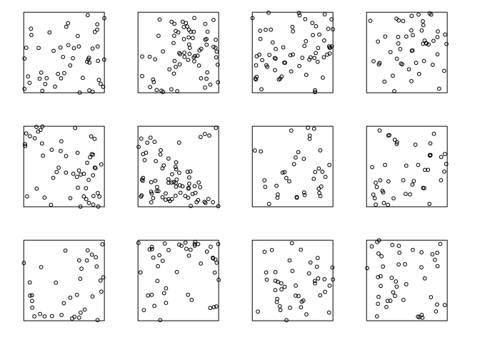
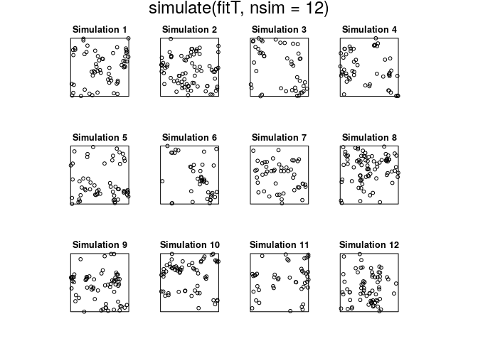
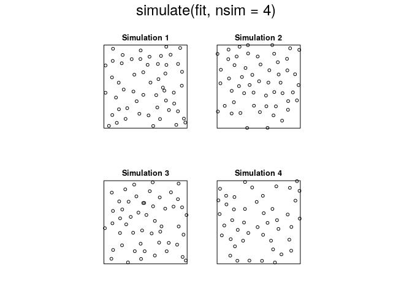
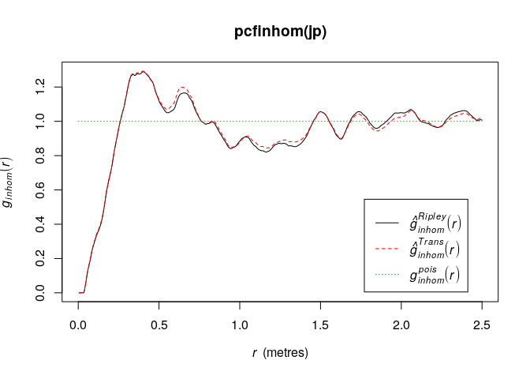
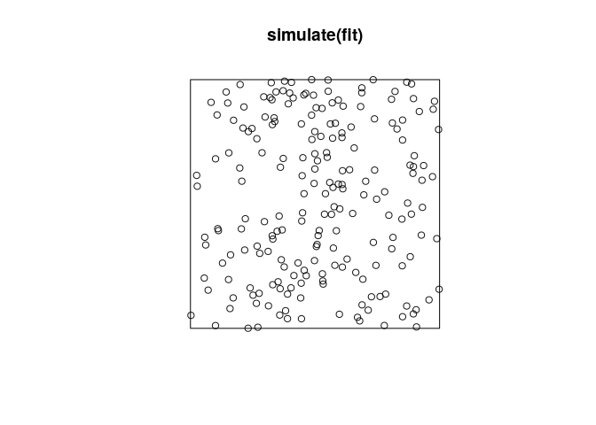

Notes for session 3
================
Adrian Baddeley and Ege Rubak
July 15, 2019

# Dependence between points

Another important goal is to detect stochastic dependence between points
in a point pattern.

<!-- -->

  - The homogeneous Poisson process is regarded as completely random
    (Complete Spatial Randomness, CSR).
  - A point process is called *inhibited* if the distances between
    points are typically *larger* than expected for a random pattern
    with the same intensity.
  - A point process is called *clustered* if the distances between
    points are typically *smaller* than would be expected for a random
    pattern with the same intensity.

The terms *inhibited* and *clustered* are analogous, respectively, to
“negatively correlated” and “positively correlated”. They do not imply
any particular kind of stochastic dependence and they do not explain how
the pattern was generated.

Dependence between points is sometimes called *“interaction”*, but this
term is dangerous because it suggests a particular mechanism for the
dependence.

## Exploratory tools

Traditionally (1976-2005) dependence between points was investigated
using exploratory tools such as Ripley’s
 function and the pair
correlation function. While these methods are useful and convenient,
they have limitations. They have become so popular that many user
communities are not interested in learning better methods that have been
developed in recent years. In this workshop, as an experiment we are
reducing the coverage of these methods to a minimum, so that we can
concentrate on the more modern methods.

### K-function

The (Ripley) -function
assumes the point process has constant intensity
.
It is defined so that, for a typical random point in the point process,
the number of other random points lying closer than a distance
 has expected value
").

For a completely random (homogeneous Poisson) process,  = \\pi r^2"). An inhibited process will usually have  \< \\pi r^2"), while a clustered process will have  \> \\pi r^2"), for appropriate values of
.

An estimate of the 
function can be computed for a point pattern dataset `X` by typing `K <-
Kest(X)`.

<!-- -->

### pair correlation function

The pair correlation function
") can be
defined as  = K^\\prime(r)/(2\\pi r)") where
") is the derivative of the
 function. The pair
correlation function can be interpreted as the probability that two
points in the point process will be separated by a distance equal to
, normalised by the
corresponding probability for a completely random (Poisson) process.

For a completely random (homogeneous Poisson) process,  = 1"). An inhibited process will usually have  \< 1"), while a clustered process will have  \> 1"), for appropriate values of
.

An estimate of the pair correlation function can be computed for a point
pattern dataset `X` by typing `g <- pcf(X)`.

<!-- -->

## Explicit Models for clustered data

``` r
plot(redwood)
```

<!-- -->

### Cluster processes

A cluster process is generated in two stages.

1.  a point pattern of *“parent”* points
     is generated;
2.  around each parent point
    , a finite
    pattern of *“offspring”* points  is generated;
3.  the offspring of all parents are collected together into a single
    point pattern .

In a *Thomas cluster process*,

1.  the parents are a homogeneous Poisson process with intensity
    ;
2.  each parent has a Poisson number (with mean
    ) of
    offspring, which are displaced from the parent by independent
    Gaussian vectors with standard deviation
    .

Here are simulated realisations of a Thomas process:

``` r
plot(rThomas(kappa=10, sigma=0.2, mu=5, nsim=12),
     main="", main.panel="")
```

<!-- -->

Maximum likelihood fitting of cluster processes is difficult because the
likelihood is quite complicated. However, the
-function of such
cluster processes is known analytically, so the model can be fitted by
the method of moments (matching the model’s theoretical
-function to the
empirical -function of
the data). This is performed by the `spatstat` function `kppm`.

``` r
fitT <- kppm(redwood ~ 1, "Thomas")
fitT
```

    ## Stationary cluster point process model
    ## Fitted to point pattern dataset 'redwood'
    ## Fitted by minimum contrast
    ##  Summary statistic: K-function
    ## 
    ## Uniform intensity:   62
    ## 
    ## Cluster model: Thomas process
    ## Fitted cluster parameters:
    ##      kappa      scale 
    ## 23.5511449  0.0470461 
    ## Mean cluster size:  2.632568 points

``` r
plot(simulate(fitT, nsim=12))
```

    ## Generating 12 simulations... 1, 2, 3, 4, 5, 6, 7, 8, 9, 10, 11,  12.
    ## Done.

<!-- -->

``` r
kppm(redwood ~ x+y, "Thomas")
```

    ## Inhomogeneous cluster point process model
    ## Fitted to point pattern dataset 'redwood'
    ## Fitted by minimum contrast
    ##  Summary statistic: inhomogeneous K-function
    ## 
    ## Log intensity:  ~x + y
    ## 
    ## Fitted trend coefficients:
    ## (Intercept)           x           y 
    ##  3.95144951  0.29770284 -0.04607577 
    ## 
    ## Cluster model: Thomas process
    ## Fitted cluster parameters:
    ##       kappa       scale 
    ## 22.97116104  0.04625136 
    ## Mean cluster size:  [pixel image]

### Cox processes

A *Cox process* is formed in two steps:

1.  a random function
    ") is generated;
2.  Given the realisation of the random function, a Poisson point
    process is generated with intensity function
    ").

In a *log-Gaussian Cox process*, the random function
") is such that ") is a Gaussian random function.

These models can be fitted by the same technique:

``` r
kppm(redwood ~ x+y, "LGCP")
```

    ## Inhomogeneous Cox point process model
    ## Fitted to point pattern dataset 'redwood'
    ## Fitted by minimum contrast
    ##  Summary statistic: inhomogeneous K-function
    ## 
    ## Log intensity:  ~x + y
    ## 
    ## Fitted trend coefficients:
    ## (Intercept)           x           y 
    ##  3.95144951  0.29770284 -0.04607577 
    ## 
    ## Cox model: log-Gaussian Cox process
    ##  Covariance model: exponential
    ## Fitted covariance parameters:
    ##        var      scale 
    ## 1.09380346 0.09796466 
    ## Fitted mean of log of random intensity: [pixel image]

## Models for inhibited data

``` r
plot(cells)
```

<!-- -->

``` r
jp <- residualspaper$Fig1
plot(jp)
```

<!-- -->

### Gibbs models

Gibbs models were developed in theoretical physics to describe the
behaviour of molecular gases. A point pattern
 represents a spatial
configuration of molecules. The probability of a particular
configuration  is   
 = Z \\exp(- U(x))
")  
where ") is
the potential energy of the configuration, and
 is a normalising
constant. In fact ") is a probability density relative to the completely random
(homogeneous Poisson) point process.

To visualise this, imagine that we first generate an infinite “ensemble”
of realisations of the homogeneous Poisson process. Then each
realisation is either deleted or retained (in its entirety) depending on
its potential energy; a realisation
 is retained with
probability
)"). Then what remains is an ensemble of realisations of the
Gibbs process.

The simplest example is the *hard core process* in which the points
represent the centres of discs of diameter
 which cannot overlap. A
realisation  has
potential energy  = -\\infty") if any pair of points in
 lies closer than
distance ; otherwise it
has potential  = 0"). Now generate an infinite ensemble of realisations of the
Poisson process. Then delete any configuration which contains a pair of
points closer than distance . The remaining realisations are an ensemble of realisations of the
hard core process.

Gibbs models can be fitted to point pattern data by maximising Besag’s
*pseudolikelihood*. This is performed by `ppm`.

``` r
ppm(cells~ 1, Hardcore())
```

    ## Stationary Hard core process
    ## 
    ## First order term:  beta = 282.7782
    ## 
    ## Hard core distance:  0.08168525
    ## 
    ## For standard errors, type coef(summary(x))

``` r
minnndist(cells)
```

    ## [1] 0.08363014

``` r
ppm(cells ~ 1, Strauss(0.1))
```

    ## Stationary Strauss process
    ## 
    ## First order term:  beta = 1138.136
    ## 
    ## Interaction distance:    0.1
    ## Fitted interaction parameter gamma:   0.0050219
    ## 
    ## Relevant coefficients:
    ## Interaction 
    ##    -5.29395 
    ## 
    ## For standard errors, type coef(summary(x))

``` r
fit <- ppm(cells ~ 1, Strauss(0.1))
plot(simulate(fit, nsim=4))
```

    ## Generating 4 simulated patterns ...1, 2, 3,  4.

<!-- -->

``` r
plot(pcfinhom(jp))
```

<!-- -->

``` r
minnndist(jp)
```

    ## [1] 0.1410937

``` r
ppm(jp ~ x+y, Strauss(0.2))
```

    ## Nonstationary Strauss process
    ## 
    ## Log trend:  ~x + y
    ## 
    ## Fitted trend coefficients:
    ## (Intercept)           x           y 
    ## 0.679292879 0.006806174 0.024664271 
    ## 
    ## Interaction distance:    0.2
    ## Fitted interaction parameter gamma:   0.6367406
    ## 
    ## Relevant coefficients:
    ## Interaction 
    ##   -0.451393 
    ## 
    ## For standard errors, type coef(summary(x))

``` r
ppm(jp ~ x+y, Strauss(0.5))
```

    ## Nonstationary Strauss process
    ## 
    ## Log trend:  ~x + y
    ## 
    ## Fitted trend coefficients:
    ##  (Intercept)            x            y 
    ##  0.364642729 -0.004808391  0.033863194 
    ## 
    ## Interaction distance:    0.5
    ## Fitted interaction parameter gamma:   1.1799626
    ## 
    ## Relevant coefficients:
    ## Interaction 
    ##   0.1654827 
    ## 
    ## For standard errors, type coef(summary(x))
    ## 
    ## *** Model is not valid ***
    ## *** Interaction parameters are outside valid range ***

### Determinantal point process models

Determinantal point process models are a relatively new class of models
with many attractive theoretical properties, but are not yet well
understood for modelling purposes.

The likelihood is determined by the first and second moments (the
intensity and the pair correlation function). These models can be fitted
in `spatstat` using the function `dppm`.

``` r
dppm(jp ~ x+y, dppGauss)
```

    ## Inhomogeneous determinantal point process model
    ## Fitted to point pattern dataset 'jp'
    ## Fitted by minimum contrast
    ##  Summary statistic: inhomogeneous K-function
    ## 
    ## Log intensity:  ~x + y
    ## 
    ## Fitted trend coefficients:
    ## (Intercept)           x           y 
    ## 0.591839808 0.014329205 0.009643885 
    ## 
    ## Fitted DPP model:
    ## Gaussian determinantal point process model
    ## The parameters are: lambda = an image, alpha = 0.06402, d = 2
    ## The parameter lambda specifies the intensity of the process.
    ## The parameter d specifies the dimension of the state space.

``` r
fit <- dppm(jp ~ polynom(x,y,2),
            dppMatern,
        statistic="pcf", statargs=list(stoyan=0.2))
```

    ## Warning: Some values of the empirical function 'pcf' were infinite or NA.
    ## Range of r values was reset to [0.0048828125, 2.5]

``` r
plot(predict(fit))      
```

<!-- -->

``` r
plot(simulate(fit))
```

<!-- -->
