Lab 2: Intensity – solutions
================

This session covers exploratory tools and formal model-fitting
procedures for investigating intensity.

``` r
library(spatstat)
```

### Exercise 1

The dataset `japanesepines` contains the locations of Japanese Black
Pine trees in a study region.

1.  Plot the `japanesepines` data.
    
    We use the generic `plot` function which is dispatched to
    `plot.ppp`:
    
    ``` r
    plot(japanesepines)
    ```
    
    <!-- -->

2.  What is the average intensity (the average number of points per unit
    area?
    
    The average intensity can be computed via `intensity.ppp`:
    
    ``` r
    intensity(japanesepines)
    ```
    
        ## [1] 65

3.  Using `density.ppp`, compute a kernel estimate of the
    spatially-varying intensity function for the Japanese pines data,
    using a Gaussian kernel with standard deviation
     units, and store the estimated intensity in an object
    `D` say.
    
    From the documentation (`?density.ppp`) we see that the following
    will work:
    
    ``` r
    D <- density(japanesepines, sigma = 0.1)
    ```

4.  Plot a colour image of the kernel estimate `D`.
    
    The plotting of the colour image is automatically done by dispatched
    call to the `plot.im` method by calling `plot` on the `im` object.
    
    ``` r
    plot(D, main = "")
    ```
    
    <!-- -->

5.  Most plotting commands will accept the argument `add=TRUE` and
    interpret it to mean that the plot should be drawn over the existing
    display, without clearing the screen beforehand. Use this to plot a
    colour image of the kernel estimate `D` with the original Japanese
    Pines data superimposed.
    
    We can use the `add = TRUE` functionality of the plotting methods.
    
    ``` r
    plot(D, main = "")
    plot(japanesepines, add = TRUE, cols = "white", cex = 0.5, pch = 16)
    ```
    
    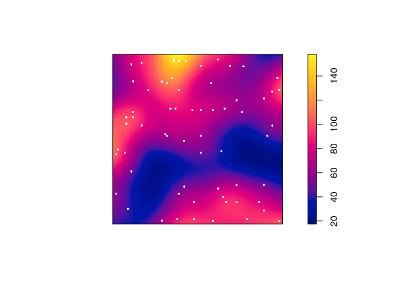<!-- -->

6.  Plot the kernel estimate without the ‘colour ribbon’.
    
    From `help("plot.im")` we see that `ribbon = FALSE` disables the
    colour key:
    
    ``` r
    plot(D, main = "", ribbon = FALSE)
    plot(japanesepines, add = TRUE, cols = "white", cex = 0.5, pch = 16)
    ```
    
    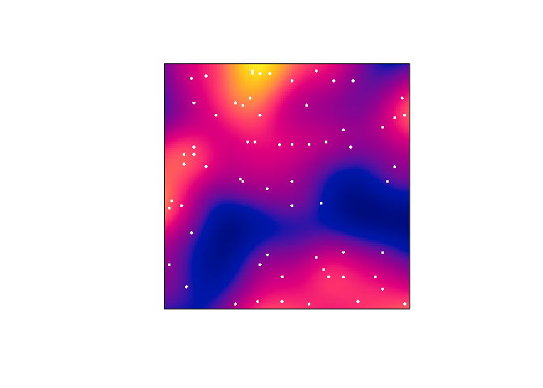<!-- -->

7.  Try the following command
    
    ``` r
    persp(D, theta=70, phi=25, shade=0.4)
    ```
    
    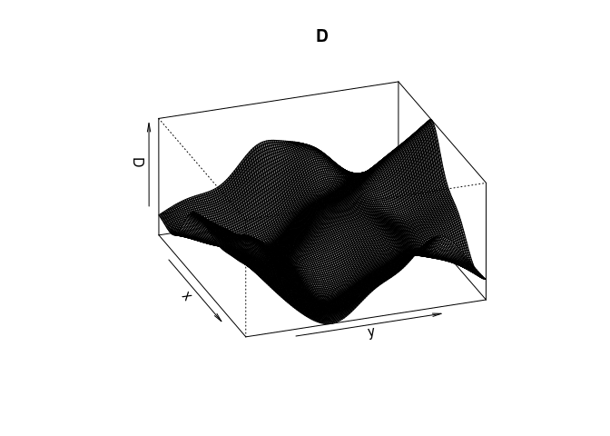<!-- --> and
    find the documentation for the arguments `theta`, `phi` and `shade`.
    
    It dispatches to `persp.im`, but these arguments are then passed
    down to `persp.default` through the dots (`...`). From the
    documentation of `persp.default` they are “angles defining the
    viewing direction. `theta` gives the azimuthal direction and `phi`
    the colatitude.” The `shade` controls the shading of the surface
    facets.
    
    ``` r
    persp(D, theta=70, phi=25, shade=0.4, main = "")
    ```
    
    <!-- -->

8.  Find the maximum and minimum values of the intensity estimate over
    the study region. (Hint: Use `summary` or `range`)
    
    ``` r
    range(D)
    ```
    
        ## [1]  17.47221 157.95229

9.  The kernel estimate of intensity is defined so that its integral
    over the entire study region is equal to the number of points in the
    data pattern, ignoring edge effects. Check whether this is
    approximately true in this example. (Hint: use `integral`)
    
    Calling `integral.im` we see that the integral is close to the
    observed number of points 65:
    
    ``` r
    round(integral(D))
    ```
    
        ## [1] 64

### Exercise 2

The `bei` dataset gives the locations of trees in a survey area with
additional covariate information in a list `bei.extra`.

1.  Assign the elevation covariate to a variable `elev` by typing
    
    ``` r
    elev <- bei.extra$elev
    ```

2.  Plot the trees on top of an image of the elevation covariate.
    
    ``` r
    plot(elev)
    plot(bei, add = TRUE, col = "black")
    ```
    
    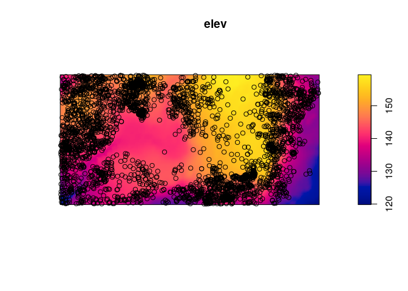<!-- -->

3.  Assume that the intensity of trees is a function  = \\rho(e(u))") where
    ") is the
    terrain elevation at location u. Compute a nonparametric estimate of
    the function  and plot it by
    
    ``` r
    rh <- rhohat(bei, elev)
    plot(rh)
    ```
    
    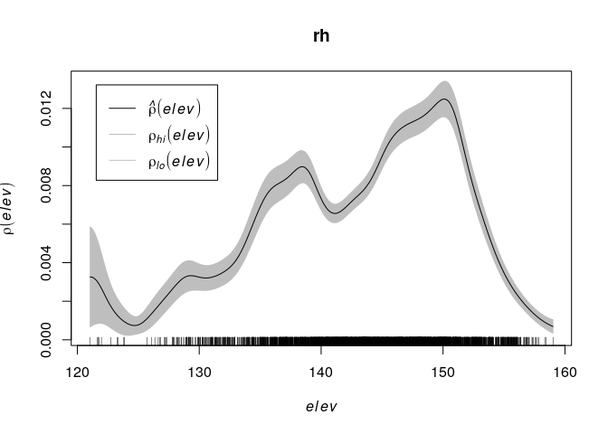<!-- -->

4.  Compute the predicted intensity based on this estimate of
    .
    
    ``` r
    prh <- predict(rh)
    plot(prh, main = "")
    plot(bei, add = TRUE, cols = "white", cex = .2, pch = 16)
    ```
    
    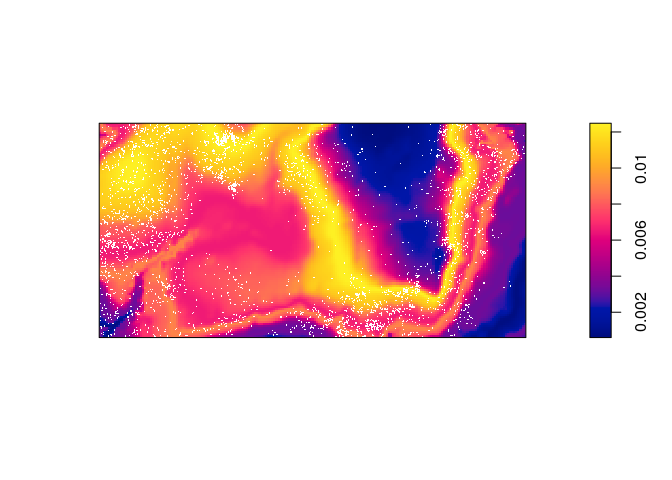<!-- -->

5.  Compute a non-parametric estimate of intensity by kernel smoothing,
    and compare with the predicted intensity above.
    
    The kernel density estimate of the points is computed and plotted
    with the following code:
    
    ``` r
    dbei <- density(bei, sigma = bw.scott)
    plot(dbei, main = "")
    plot(bei, add = TRUE, cols = "white", cex = .2, pch = 16)
    ```
    
    <!-- -->
    
    Which seems to be quite different form the predicted intentisty.

6.  Bonus info: To plot the two intensity estimates next to each other
    you collect the estimates as a spatial object list (`solist`) and
    plot the result (the estimates are called `pred` and `ker` below):
    
    ``` r
    l <- solist(pred, ker)
    plot(l, equal.ribbon = TRUE, main = "", 
         main.panel = c("rhohat prediction", "kernel smoothing"))
    ```
    
    ``` r
    l <- solist(prh, dbei)
    plot(l, equal.ribbon = TRUE, main = "",
         main.panel = c("rhohat prediction", "kernel smoothing"))
    ```
    
    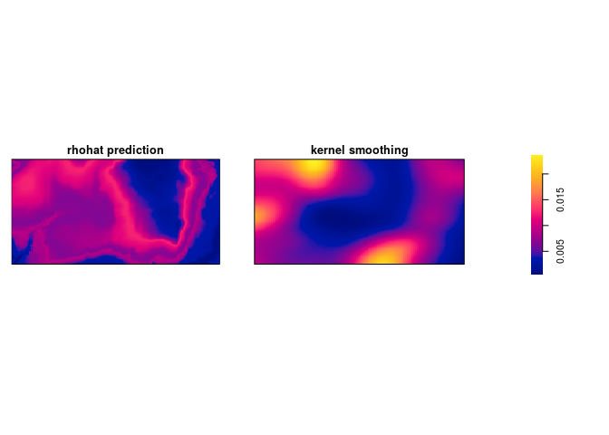<!-- -->

### Exercise 3

The command `rpoispp(100)` generates realisations of the Poisson process
with intensity  in the unit square.

1.  Repeat the command `plot(rpoispp(100))` several times to build your
    intuition about the appearance of a completely random pattern of
    points.
    
    Let’s plot it three
    times:
    
    ``` r
    replicate(3, plot(rpoispp(lambda = 100), main = ""))
    ```
    
    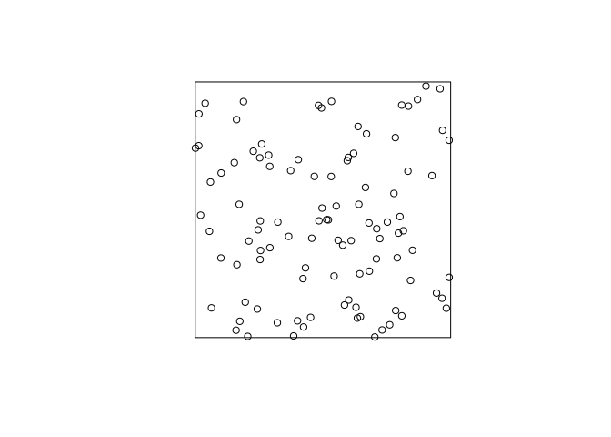<!-- -->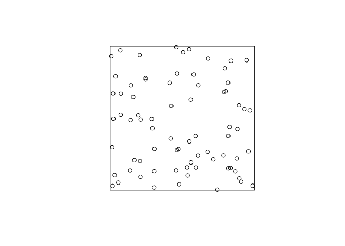<!-- -->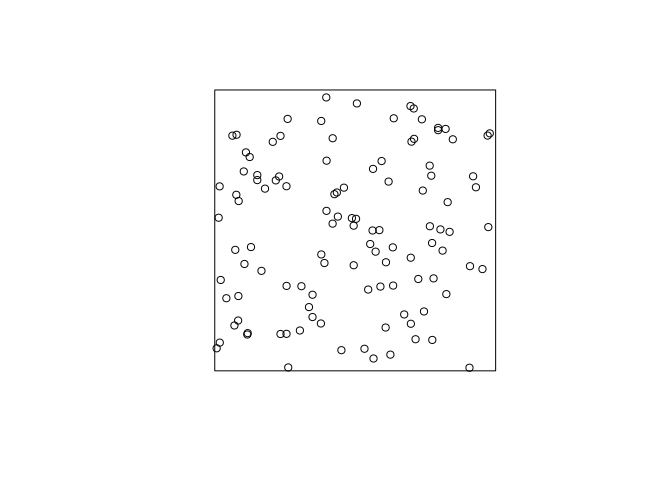<!-- -->
    
    As can be seen, the points (unsurprisingly) are much more random
    that want one might think. “Randomly” drawing points on a piece of
    paper one would usually draw a point pattern that is more regular
    (i.e. the points are repulsive).

2.  Try the same thing with intensity .
    
    For brevity we only do it once here:
    
    ``` r
    plot(rpoispp(lambda = 1.5), main = "")
    ```
    
    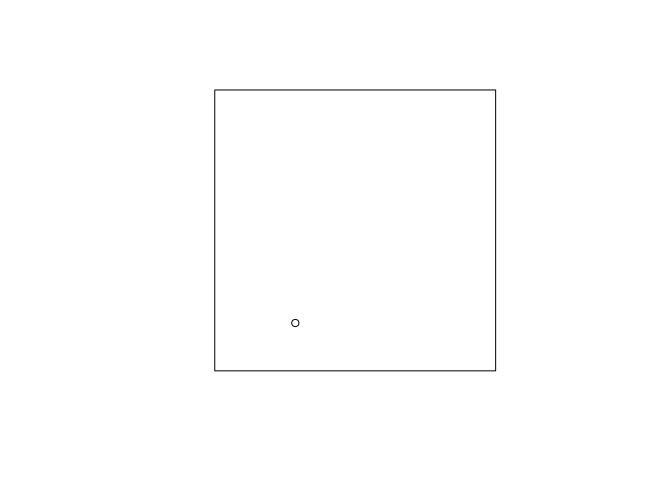<!-- -->
    
    Here we expect 1.5 points in the plot each time.

### Exercise 4

Returning to the Japanese Pines data,

1.  Fit the uniform Poisson point process model to the Japanese Pines
    data
    
    ``` r
    ppm(japanesepines~1)
    ```
    
    We fit the Poisson process model with the given command and print
    the output:
    
    ``` r
    m.jp <- ppm(japanesepines ~ 1)
    print(m.jp)
    ```
    
        ## Stationary Poisson process
        ## Intensity: 65
        ##             Estimate      S.E.  CI95.lo  CI95.hi Ztest     Zval
        ## log(lambda) 4.174387 0.1240347 3.931284 4.417491   *** 33.65499

2.  Read off the fitted intensity. Check that this is the correct value
    of the maximum likelihood estimate of the intensity.
    
    We extract the coeficient with the `coef` function, and compare to
    the straightforward estimate obtained by \`intensity\`\`:
    
    ``` r
    unname(exp(coef(m.jp)))
    ```
    
        ## [1] 65
    
    ``` r
    intensity(japanesepines)
    ```
    
        ## [1] 65
    
    As seen, they agree exactly.

### Exercise 5

The `japanesepines` dataset is believed to exhibit spatial
inhomogeneity.

1.  Plot a kernel smoothed intensity estimate.
    
    Plot the kernel smoothed intensity estimate selecting the bandwidth
    with `bw.scott`:
    
    ``` r
    jp.dens <- density(japanesepines, sigma = bw.scott)
    plot(jp.dens)
    plot(japanesepines, col = "white", cex = .4, pch = 16, add = TRUE)
    ```
    
    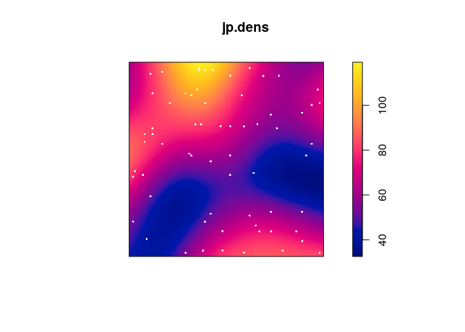<!-- -->

2.  Fit the Poisson point process models with loglinear intensity (trend
    formula `~x+y`) and log-quadratic intensity (trend formula
    `~polynom(x,y,2)`) to the Japanese Pines data.
    
    We fit the two models with `ppm`:
    
    ``` r
    jp.m <- ppm(japanesepines ~ x + y)
    jp.m2 <- ppm(japanesepines ~ polynom(x, y, 2) )
    ```

3.  extract the fitted coefficients for these models using `coef`.
    
    ``` r
    coef(jp.m)
    ```
    
        ## (Intercept)           x           y 
        ##   4.0670790  -0.2349641   0.4296171
    
    ``` r
    coef(jp.m2)
    ```
    
        ## (Intercept)           x           y      I(x^2)    I(x * y)      I(y^2) 
        ##   4.0645501   1.1436854  -1.5613621  -0.7490094  -1.2009245   2.5061569

4.  Plot the fitted model intensity (using `plot(predict(fit))`)
    
    ``` r
    par(mar=rep(0,4))
    plot(predict(jp.m), main = "")
    ```
    
    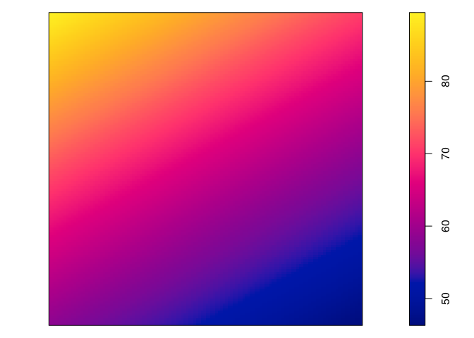<!-- -->
    
    ``` r
    plot(predict(jp.m, se=TRUE)$se, main = "")
    ```
    
    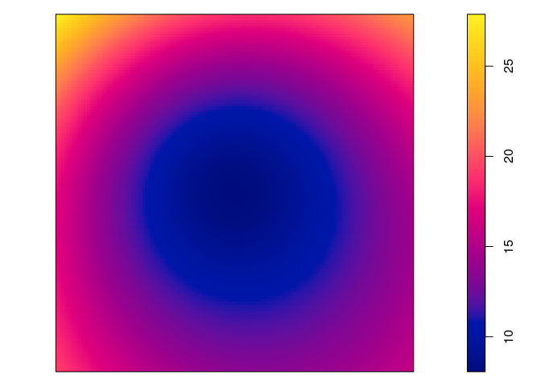<!-- -->
    
    ``` r
    plot(predict(jp.m2), main = "")
    ```
    
    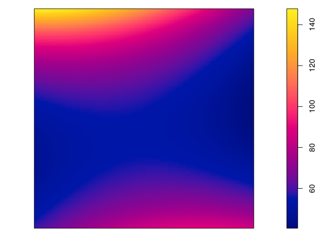<!-- -->
    
    ``` r
    plot(predict(jp.m2, se=TRUE)$se, main = "")
    ```
    
    <!-- -->

5.  perform the Likelihood Ratio Test for the null hypothesis of a
    loglinear intensity against the alternative of a log-quadratic
    intensity, using `anova`.
    
    ``` r
    anova(jp.m, jp.m2)
    ```
    
        ## Analysis of Deviance Table
        ## 
        ## Model 1: ~x + y   Poisson
        ## Model 2: ~x + y + I(x^2) + I(x * y) + I(y^2)      Poisson
        ##   Npar Df Deviance
        ## 1    3            
        ## 2    6  3   3.3851

6.  Generate 10 simulated realisations of the fitted log-quadratic
    model, and plot them, using `plot(simulate(fit, nsim=10))` where
    `fit` is the fitted model.
    
    ``` r
    par(mar=rep(0.5,4))
    plot(simulate(jp.m2, nsim=10), main = "")
    ```
    
        ## Generating 10 simulated patterns ...1, 2, 3, 4, 5, 6, 7, 8, 9,  10.
    
    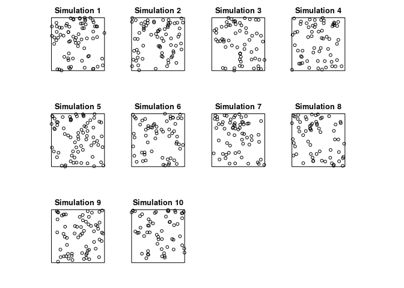<!-- -->

### Exercise 6

The `update` command can be used to re-fit a point process model using a
different model formula.

1.  Type the following commands and interpret the results:
    
    ``` r
    fit0 <- ppm(japanesepines ~ 1)
    fit1 <- update(fit0, . ~ x)
    fit1
    ```
    
        ## Nonstationary Poisson process
        ## 
        ## Log intensity:  ~x
        ## 
        ## Fitted trend coefficients:
        ## (Intercept)           x 
        ##   4.2895587  -0.2349362 
        ## 
        ##               Estimate      S.E.   CI95.lo   CI95.hi Ztest       Zval
        ## (Intercept)  4.2895587 0.2411952  3.816825 4.7622926   *** 17.7845936
        ## x           -0.2349362 0.4305416 -1.078782 0.6089098       -0.5456759
    
    ``` r
    fit2 <- update(fit1, . ~ . + y)
    fit2
    ```
    
        ## Nonstationary Poisson process
        ## 
        ## Log intensity:  ~x + y
        ## 
        ## Fitted trend coefficients:
        ## (Intercept)           x           y 
        ##   4.0670790  -0.2349641   0.4296171 
        ## 
        ##               Estimate      S.E.    CI95.lo   CI95.hi Ztest       Zval
        ## (Intercept)  4.0670790 0.3341802  3.4120978 4.7220602   *** 12.1703167
        ## x           -0.2349641 0.4305456 -1.0788181 0.6088898       -0.5457357
        ## y            0.4296171 0.4318102 -0.4167154 1.2759495        0.9949211
    
    OK, let’s do that:
    
    ``` r
    fit0 <- ppm(japanesepines ~ 1)
    fit1 <- update(fit0, . ~ x)
    fit1
    ```
    
        ## Nonstationary Poisson process
        ## 
        ## Log intensity:  ~x
        ## 
        ## Fitted trend coefficients:
        ## (Intercept)           x 
        ##   4.2895587  -0.2349362 
        ## 
        ##               Estimate      S.E.   CI95.lo   CI95.hi Ztest       Zval
        ## (Intercept)  4.2895587 0.2411952  3.816825 4.7622926   *** 17.7845936
        ## x           -0.2349362 0.4305416 -1.078782 0.6089098       -0.5456759
    
    ``` r
    fit2 <- update(fit1, . ~ . + y)
    fit2
    ```
    
        ## Nonstationary Poisson process
        ## 
        ## Log intensity:  ~x + y
        ## 
        ## Fitted trend coefficients:
        ## (Intercept)           x           y 
        ##   4.0670790  -0.2349641   0.4296171 
        ## 
        ##               Estimate      S.E.    CI95.lo   CI95.hi Ztest       Zval
        ## (Intercept)  4.0670790 0.3341802  3.4120978 4.7220602   *** 12.1703167
        ## x           -0.2349641 0.4305456 -1.0788181 0.6088898       -0.5457357
        ## y            0.4296171 0.4318102 -0.4167154 1.2759495        0.9949211

2.  Now type `step(fit2)` and interpret the results.
    
    The backwards selection is done with the code:
    
    ``` r
    step(fit2)
    ```
    
        ## Start:  AIC=-407.96
        ## ~x + y
        ## 
        ##        Df     AIC
        ## - x     1 -409.66
        ## - y     1 -408.97
        ## <none>    -407.96
        ## 
        ## Step:  AIC=-409.66
        ## ~y
        ## 
        ##        Df     AIC
        ## - y     1 -410.67
        ## <none>    -409.66
        ## 
        ## Step:  AIC=-410.67
        ## ~1
    
        ## Stationary Poisson process
        ## Intensity: 65
        ##             Estimate      S.E.  CI95.lo  CI95.hi Ztest     Zval
        ## log(lambda) 4.174387 0.1240347 3.931284 4.417491   *** 33.65499
    
    First, given two models the preferred model is the one with the
    minimum AIC value. In step 1, the removal of x results in the least
    AIC and is hence deleted. In step 2, removing y results in a lower
    AIC than not deleing anything and is thus deleted. This results in
    the constant model.

### Exercise 7

The `bei` dataset gives the locations of trees in a survey area with
additional covariate information in a list `bei.extra`.

1.  Fit a Poisson point process model to the data which assumes that the
    intensity is a loglinear function of terrain slope and elevation
    (hint: use `data = bei.extra` in `ppm`).
    
    We fit the log-linear intensity model with the following:
    
    ``` r
    bei.m <- ppm(bei ~ elev + grad, data = bei.extra)
    ```

2.  Read off the fitted coefficients and write down the fitted intensity
    function.
    
    The coefficents are extraced with `coef`:
    
    ``` r
    coef(bei.m)
    ```
    
        ## (Intercept)        elev        grad 
        ## -8.56355220  0.02143995  5.84646680
    
    Hence the model is  = -8.55 + 0.02\\cdot E(u) + 5.84 G(u)") where
    ") and
    ") is the
    elevation and gradient, respectively, at
    .

3.  Plot the fitted intensity as a colour image.
    
    ``` r
    plot(predict(bei.m), main = "")
    plot(bei, cex = 0.3, pch = 16, cols = "white", add = TRUE)
    ```
    
    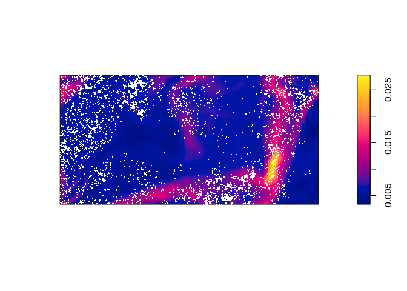<!-- -->

4.  extract the estimated variance-covariance matrix of the coefficient
    estimates, using `vcov`.
    
    We call `vcov` on the fitted model object:
    
    ``` r
    vcov(bei.m)
    ```
    
        ##               (Intercept)          elev          grad
        ## (Intercept)  0.1163586583 -7.774771e-04 -0.0354792767
        ## elev        -0.0007774771  5.234331e-06  0.0001992266
        ## grad        -0.0354792767  1.992266e-04  0.0654239289

5.  Compute and plot the standard error of the intensity estimate (see
    `help(predict.ppm)`).
    
    From the documentation the argument `se` will trigger the
    computation of the standard errors. These are then plotted in the
    standard manner.
    
    ``` r
    std.err <- predict(bei.m, se = TRUE)$se
    plot(std.err, main = "")
    ```
    
    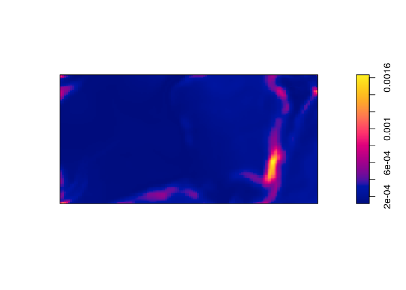<!-- -->

### Exercise 8

Fit Poisson point process models to the Japanese Pines data, with the
following trend formulas. Read off an expression for the fitted
intensity function in each
case.

| Trend formula      | Fitted intensity function                                                                                                                                                                                                                                                                         |
| :----------------- | :------------------------------------------------------------------------------------------------------------------------------------------------------------------------------------------------------------------------------------------------------------------------------------------------ |
| `~1`               |  = 4.17")                                                                                                                                                                    |
| `~x`               |  = 4.28 - 0.23x")                                                                                                                                        |
| `~sin(x)`          |  = 4.29 - 0.26\\sin(x)")                                                                                                              |
| `~x+y`             |  = 4.07 - 0.23x + 0.42y")                                                                                                          |
| `~polynom(x,y,2)`  |  = 4.06 + 1.14x - 1.56y - 0.75x^2 - 1.20xy + 2.51y^2") |
| `~factor(x < 0.4)` |  = 4.10 + 0.16\\cdot I(x \< 0.4)")                                                                       |

(Here, ") denote the indicator function.)

The fitted intensity functions have been written into the table based on
the follwing model fits:

``` r
coef(ppm1 <- ppm(japanesepines ~ 1)) 
```

    ## log(lambda) 
    ##    4.174387

``` r
coef(ppm2 <- ppm(japanesepines ~ x))
```

    ## (Intercept)           x 
    ##   4.2895587  -0.2349362

``` r
coef(ppm3 <- ppm(japanesepines ~ sin(x)))
```

    ## (Intercept)      sin(x) 
    ##   4.2915935  -0.2594537

``` r
coef(ppm4 <- ppm(japanesepines ~ x + y))
```

    ## (Intercept)           x           y 
    ##   4.0670790  -0.2349641   0.4296171

``` r
coef(ppm5 <- ppm(japanesepines ~ polynom(x, y, 2)))
```

    ## (Intercept)           x           y      I(x^2)    I(x * y)      I(y^2) 
    ##   4.0645501   1.1436854  -1.5613621  -0.7490094  -1.2009245   2.5061569

``` r
coef(ppm6 <- ppm(japanesepines ~ factor(x < 0.4)))
```

    ##         (Intercept) factor(x < 0.4)TRUE 
    ##           4.1048159           0.1632665

### Exercise 9

Make image plots of the fitted intensities for the inhomogeneous models
above.

Again, we use `plot(predict())`:

``` r
plot(predict(ppm1), main = "")
```

<!-- -->

``` r
plot(predict(ppm2), main = "")
```

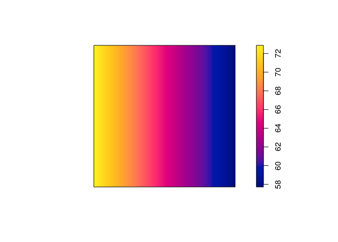<!-- -->

``` r
plot(predict(ppm3), main = "")
```

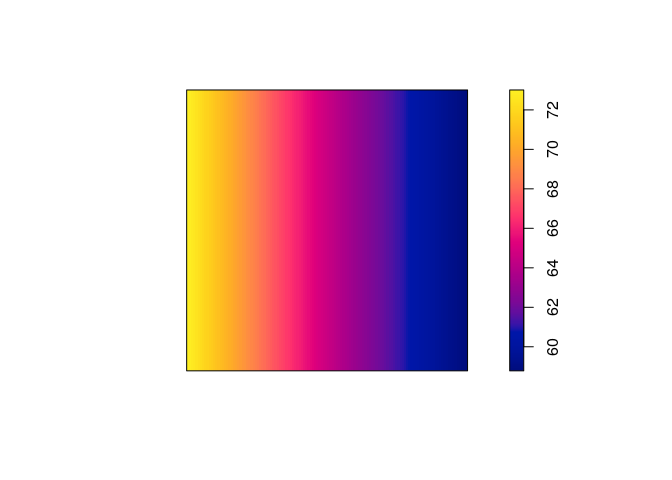<!-- -->

``` r
plot(predict(ppm4), main = "")
```

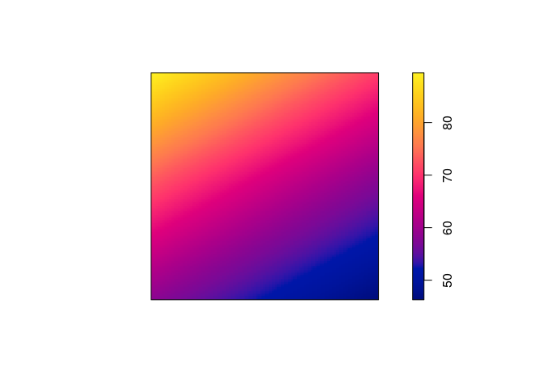<!-- -->

``` r
plot(predict(ppm5), main = "")
```

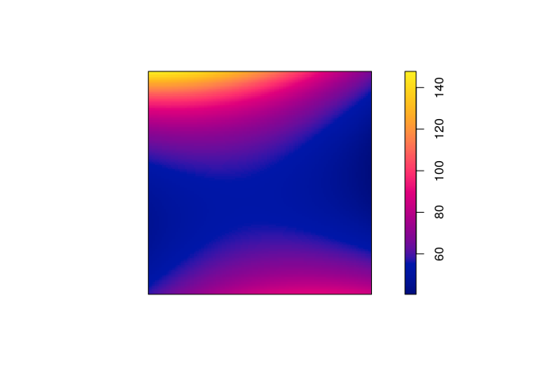<!-- -->

``` r
plot(predict(ppm6), main = "")
```

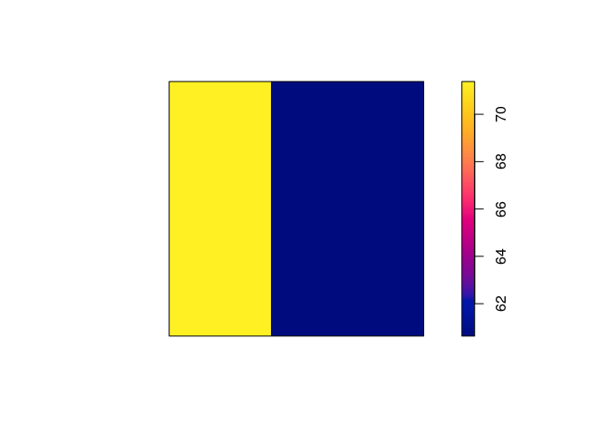<!-- -->

### Exercise 10

The dataset `hamster` is a multitype pattern representing the locations
of cells of two types, *dividing* and *pyknotic*.

1.  plot the patterns of pyknotic and dividing cells separately;
    
    ``` r
    plot(split(hamster), main = "")
    ```
    
    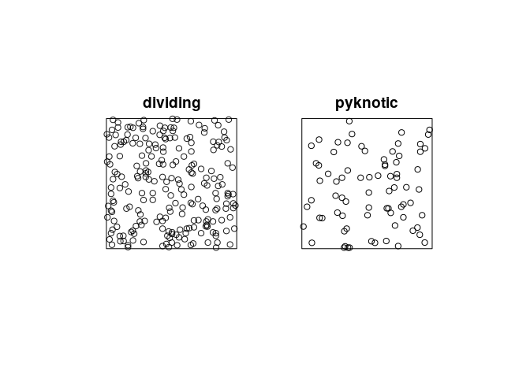<!-- -->

2.  plot kernel estimates of the intensity functions of pyknotic and
    dividing cells separately;
    
    ``` r
    plot(density(split(hamster)), main = "")
    ```
    
    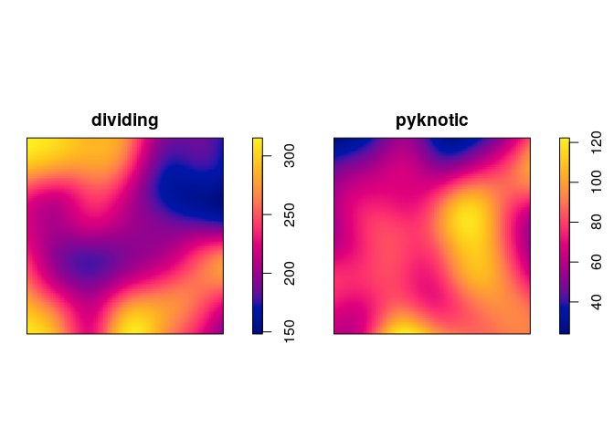<!-- -->

3.  use `relrisk` to perform cross-validated bandwidth selection and
    computation of the relative intensity of pyknotic
    cells.
    
    ``` r
    plot(relrisk(hamster, hmax = 1, relative = TRUE, control = "dividing"))
    ```
    
    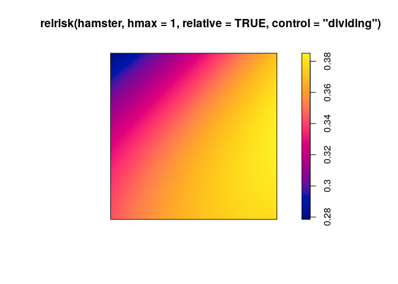<!-- -->

### Exercise 11

The dataset `ants` is a multitype point pattern representing the
locations of nests of two species of ants.

1.  plot the data.
    
    ``` r
    plot(ants)
    ```
    
    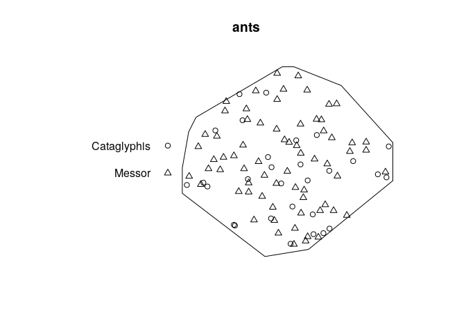<!-- -->

2.  Fit the model `ppm(ants ~ marks)` and interpret the result. Compare
    the result with `summary(ants)` and explain the similarities.
    
    ``` r
    fit1 <- ppm(ants ~ marks)
    ```
    
    This is a Poisson model with a separate constant intensity for each
    mark. The fitted intensities are:
    
    ``` r
    exp(coef(fit1)[1])
    ```
    
        ##  (Intercept) 
        ## 6.762949e-05
    
    ``` r
    exp(coef(fit1)[1] + coef(fit1)[2])
    ```
    
        ##  (Intercept) 
        ## 0.0001585795
    
    This agrees perfectly with the output of `summary(ants)`:
    
    ``` r
    summary(ants)
    ```
    
        ## Marked planar point pattern:  97 points
        ## Average intensity 0.0002261486 points per square unit (one unit = 0.5 feet)
        ## 
        ## Coordinates are integers
        ## i.e. rounded to the nearest unit (one unit = 0.5 feet)
        ## 
        ## Multitype:
        ##             frequency proportion    intensity
        ## Cataglyphis        29  0.2989691 6.761144e-05
        ## Messor             68  0.7010309 1.585372e-04
        ## 
        ## Window: polygonal boundary
        ## single connected closed polygon with 11 vertices
        ## enclosing rectangle: [-25, 803] x [-49, 717] units
        ## Window area = 428922 square units
        ## Unit of length: 0.5 feet
        ## Fraction of frame area: 0.676

3.  Fit the model `ppm(ants ~ marks + x)` and write down an expression
    for the fitted intensity function.
    
    ``` r
    fit2 <- ppm(ants ~ marks + x)
    (co <- coef(fit2))
    ```
    
        ##   (Intercept)   marksMessor             x 
        ## -9.5243832518  0.8522118655 -0.0002041438
    
    Intensity for the reference type (Cataglyphis):
    
      
     ) = \\exp(-9.5243833 + -2.0414381\\times 10^{-4} \\cdot x)")  
    
    Intensity for the other type (Messor):
    
      
     ) = \\exp(-9.5243833 + 0.8522119 + -2.0414381\\times 10^{-4} \\cdot x)")  

4.  Fit the model `ppm(ants ~ marks * x)` and write down an expression
    for the fitted intensity function.
    
    ``` r
    fit3 <- ppm(ants ~ marks * x)
    (co <- coef(fit3))
    ```
    
        ##   (Intercept)   marksMessor             x marksMessor:x 
        ## -9.605698e+00  9.676854e-01  1.107981e-05 -3.071343e-04
    
    Intensity for the reference type (Cataglyphis):
    
      
     ) = \\exp(-9.605698 + 1.1079805\\times 10^{-5} \\cdot x)")  
    
    Intensity for the other type (Messor):
    
      
     ) = \\exp(-9.605698 + 0.9676854 + (1.1079805\\times 10^{-5} + 0.9676854) \\cdot x)")  

5.  Compute the fitted intensities of the three models fitted above
    using `predict` and plot the results.
    
    ``` r
    pred <- c(predict(fit1), predict(fit2), predict(fit3))
    plot(as.solist(pred), ncols = 2, main = "")
    ```
    
    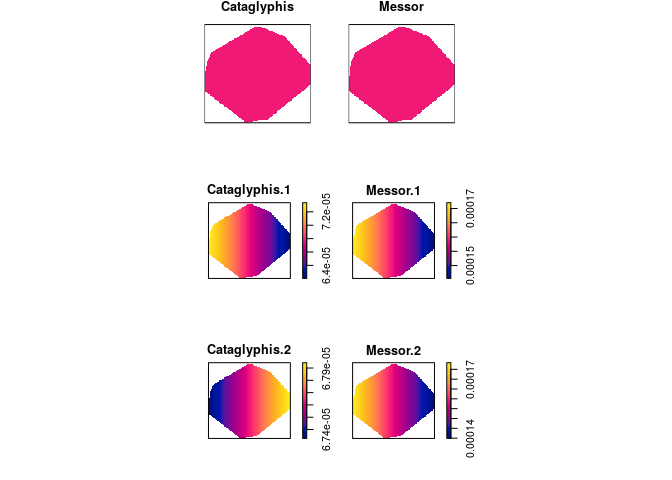<!-- -->

6.  Explain the difference between the models fitted by `ppm(ants ~
    marks + x)` and `ppm(ants ~ marks * x)` .
    
    For the additive model the effect of the `x` coordinate is the same
    for both types of ants, while the effect of `x` differs in the
    multiplicative model.

## Exercise 12

The study region for the ants’ nests data `ants` is divided into areas
of “scrub” and “field”. We want to fit a Poisson model with different
intensities in the field and scrub areas.

The coordinates of two points on the boundary line between field and
scrub are given in `ants.extra$fieldscrub`. First construct a function
that determines which side of the line we are on:

``` r
fs <- function(x,y) {
  ends <- ants.extra$fieldscrub
  angle <- atan(diff(ends$y)/diff(ends$x))
  normal <- angle + pi/2
  project <- (x - ends$x[1]) * cos(normal) + (y - ends$y[1]) * sin(normal)
  factor(ifelse(project > 0, "scrub", "field"))
}
```

Now fit the models:

``` r
ppm(ants ~ marks + side, data = list(side=fs))
ppm(ants ~ marks * side, data = list(side=fs))
```

and interpret the results.

``` r
fit1 <- ppm(ants ~ marks + side, data = list(side=fs))
fit2 <- ppm(ants ~ marks * side, data = list(side=fs))
```

In the first model the fitted intensity is lower in the scrub than in
the field (but this effect is not significant).

In the second model the fitted intensity of Cataglyphis is lower in the
scrub than the intensity of Cataglyphis in the field, where as it is the
other way around for Messor. When we allow for the different effect
between ant types the scrub/field covariate is significant.
