Lab 3: Dependence – solution
================

This session covers tools for investigating dependence between points.

``` r
library(spatstat)
```

### Exercise 1

The `swedishpines` dataset was recorded in a study plot in a large
forest. We shall assume the pattern is stationary.

1.  Calculate the estimate of the
    -function using
    `Kest`.
    
    The estimation is done with:
    
    ``` r
    K <- Kest(swedishpines)
    ```

2.  Plot the estimate of
    ")
    against 
    
    To plot the K-function, we do:
    
    ``` r
    plot(K, main = "K-function")
    ```
    
    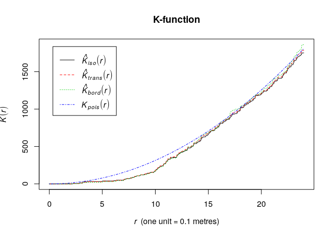<!-- -->

3.  Plot the estimate of  - \\pi\\!r^2") against
     (Hint: look at the
    `fmla` argument in `plot.fv`).
    
    The estimated K-function subtracted
     can be done via the `fmla` (formula) interface:
    
    ``` r
    plot(K, . - pi*r^2 ~ r, main = "Normalized K-function",
         legendpos = "bottomright")
    ```
    
    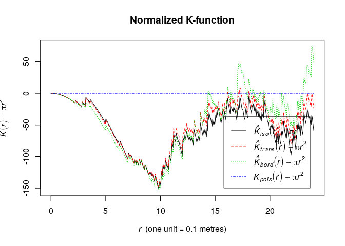<!-- -->

4.  Calculate and plot an estimate of the pair correlation function
    using `pcf`.
    
    The pair-correlation is also compute straight-forwardly:
    
    ``` r
    pcorf <- pcf(swedishpines)
    plot(pcorf)
    ```
    
    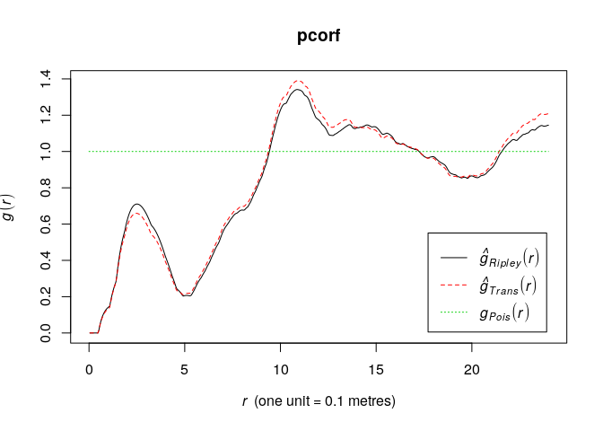<!-- -->

5.  Draw tentative conclusions from these plots about interpoint
    interaction in the data.
    
    Assuming a homogeneous point pattern, both the L- and K-function are
    less what is expected under the Poisson process the data. Thus they
    indicate a comparatively regular point pattern. Similarly, the
    pair-correlation function also suggests this.

### Exercise 2

The command `rThomas` generates simulated realisations of the Thomas
model (‘modified Thomas cluster process’).

1.  Read the help file.
    
    See `help("rThomas")`.

2.  Type `plot(rThomas(10, 0.05, 8))` a few times, and interpret the
    results.
    
    ``` r
    replicate(3, plot(rThomas(10, 0.05, 8), main = ""))
    ```
    
    <!-- -->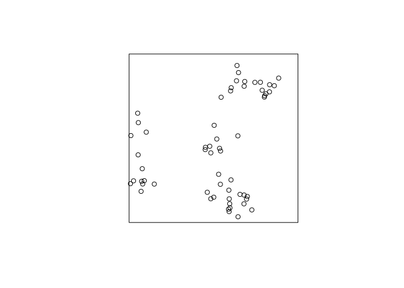<!-- -->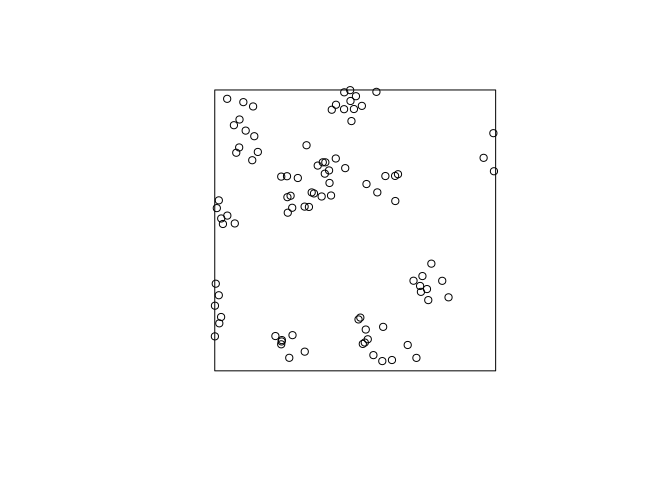<!-- -->
    
    A clustered process – on average 10 clusters with 8 points. The
    standard deviation of the cluster distribution is 0.05, so most
    points will be within distance 0.10 from their parent.

3.  Experiment with the arguments of `rThomas` to obtain point patterns
    that
    
    1.  consist of a few, well-separated, very tight clusters of points;
    
    2.  look similar to realisations of a uniform Poisson process.
    
    We get few clusters by reducing the intensity of the parent process
    (first argument). Tightly and separated clusters are obtained by
    reducing the standard deviation (second argument).
    
    ``` r
    plot(rThomas(5, scale = 0.01, mu = 8), main = "")
    ```
    
    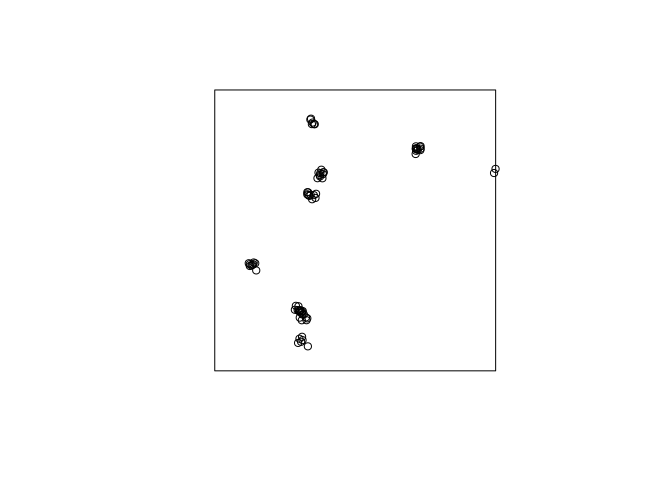<!-- -->
    
    If the are many clusters with a large standard deviation it looks
    like Poisson.
    
    ``` r
    plot(rThomas(100, scale = 1, mu = 1), main = "")
    ```
    
    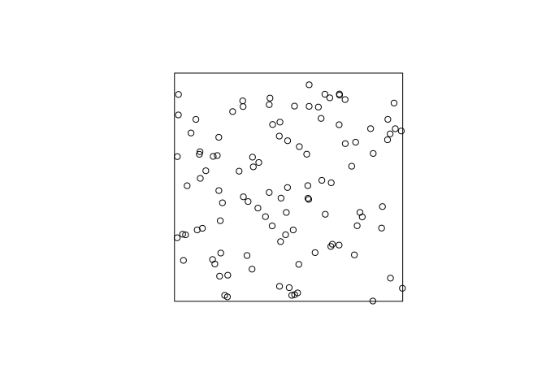<!-- -->

### Exercise 3

1.  Read the help file for `kppm`.
    
    See `help("kppm")`.

2.  Fit the Thomas model to the `redwood` data by the method of minimum
    contrast:
    
    ``` r
    fit <- kppm(redwood ~ 1, clusters="Thomas")
    fit
    plot(fit)
    ```
    
    From the documentation, the minmum contrast fitting procedure is
    default. Hence, we need not specify it.
    
    ``` r
    fit <- kppm(redwood ~ 1, clusters = "Thomas")
    fit
    ```
    
        ## Stationary cluster point process model
        ## Fitted to point pattern dataset 'redwood'
        ## Fitted by minimum contrast
        ##  Summary statistic: K-function
        ## 
        ## Uniform intensity:   62
        ## 
        ## Cluster model: Thomas process
        ## Fitted cluster parameters:
        ##      kappa      scale 
        ## 23.5511449  0.0470461 
        ## Mean cluster size:  2.632568 points
    
    ``` r
    plot(fit, main = "", pause = FALSE) 
    ```
    
    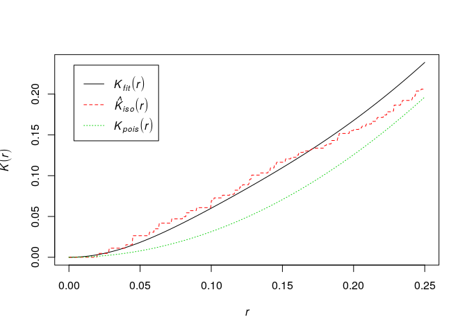<!-- -->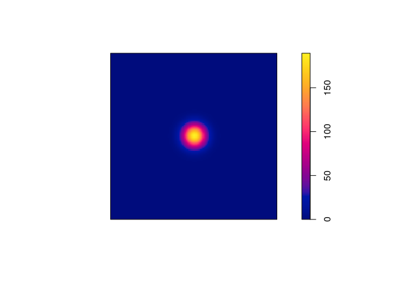<!-- -->

3.  Read off the parameters of the fitted model, and generate a
    simulated realisation of the fitted model using `rThomas`.
    
    From the previous output, we can read off the parameters to do the
    simulation (or we can use `parameters` to extract them):
    
    ``` r
    (p <- parameters(fit))
    ```
    
        ## $trend
        ## [1] 62
        ## 
        ## $kappa
        ## [1] 23.55114
        ## 
        ## $scale
        ## [1] 0.0470461
        ## 
        ## $mu
        ## [1] 2.632568
    
    ``` r
    rt2 <- rThomas(kappa = p$kappa, scale = p$scale, mu = p$mu)
    plot(rt2, main = "")
    ```
    
    <!-- -->

4.  Type `plot(simulate(fit))` to generate a simulated realisation of
    the fitted model automatically.
    
    OK, let try that alternative:
    
    ``` r
    plot(simulate(fit, drop = TRUE), main = "")
    ```
    
    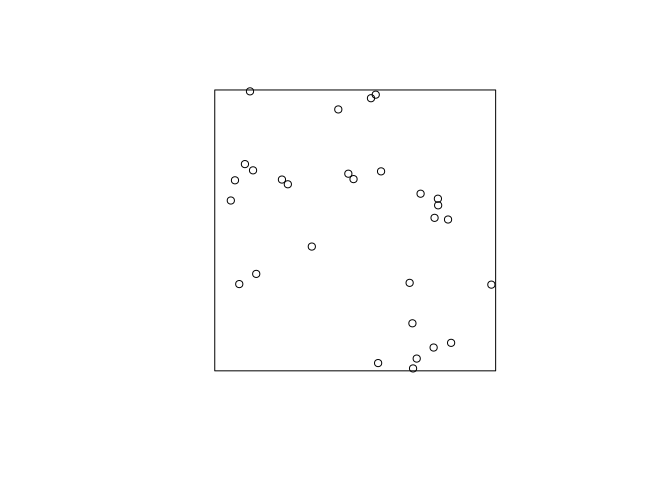<!-- -->

5.  Try the
    command
    
    ``` r
    fit2 <- kppm(redwood ~ 1, clusters="Thomas", startpar=c(kappa=10, scale=0.1))
    ```
    
    and briefly explore the fitting algorithm’s sensitivity to the
    initial guesses at the parameter values `kappa` and `scale`.
    
    For “large” kappa (parent intensity) and “small” scale (standard
    deviation), the algorithm seems quite
    robust:
    
    ``` r
    kppm(redwood ~ 1, clusters="Thomas", startpar=c(kappa=10, scale=0.1))
    ```
    
        ## Stationary cluster point process model
        ## Fitted to point pattern dataset 'redwood'
        ## Fitted by minimum contrast
        ##  Summary statistic: K-function
        ## 
        ## Uniform intensity:   62
        ## 
        ## Cluster model: Thomas process
        ## Fitted cluster parameters:
        ##       kappa       scale 
        ## 23.54757642  0.04704921 
        ## Mean cluster size:  2.632967 points
    
    ``` r
    kppm(redwood ~ 1, clusters="Thomas", startpar=c(kappa=100, scale=0.01))
    ```
    
        ## Stationary cluster point process model
        ## Fitted to point pattern dataset 'redwood'
        ## Fitted by minimum contrast
        ##  Summary statistic: K-function
        ## 
        ## Uniform intensity:   62
        ## 
        ## Cluster model: Thomas process
        ## Fitted cluster parameters:
        ##       kappa       scale 
        ## 23.54962713  0.04705395 
        ## Mean cluster size:  2.632738 points
    
    However, for a very small parent intensity (kappa) and large
    offspring scale the fit changes
    considerably.
    
    ``` r
    kppm(redwood ~ 1, clusters="Thomas", startpar=c(kappa=0.1, scale=10))
    ```
    
        ## Stationary cluster point process model
        ## Fitted to point pattern dataset 'redwood'
        ## Fitted by minimum contrast
        ##  Summary statistic: K-function
        ## 
        ## Uniform intensity:   62
        ## 
        ## Cluster model: Thomas process
        ## Fitted cluster parameters:
        ##       kappa       scale 
        ## 0.001824317 9.427722055 
        ## Mean cluster size:  33985.33 points

6.  Generate and plot several simulated realisations of the fitted
    model, to assess whether it is
        plausible.
    
    ``` r
    XX <- simulate(fit, nsim = 11)
    ```
    
        ## Generating 11 simulations... 1, 2, 3, 4, 5, 6, 7, 8, 9, 10,  11.
        ## Done.
    
    ``` r
    XX[[12]] <- redwood
    plot(XX, main = "", main.panel = "")
    ```
    
    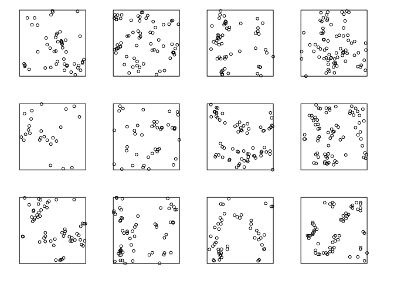<!-- -->
    
    The actual data do not look too different from the simulated (apart
    from the artificial discretisation in the real data which can be
    seen on larger plots).

7.  Extract and plot the fitted pair correlation function by
    
    ``` r
    pcffit <- pcfmodel(fit)
    plot(pcffit, xlim = c(0, 0.3))
    ```
    
    OK, let’s try that:
    
    ``` r
    pcffit <- pcfmodel(fit)
    plot(pcffit, xlim = c(0, 0.3), main = "pair correlation")
    ```
    
    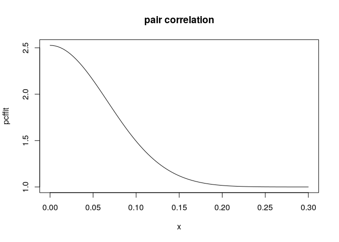<!-- -->

8.  Type `plot(envelope(fit, Lest, nsim=39))` to generate simulation
    envelopes of the 
    function from this fitted model. Do they suggest the model is
    plausible?
    
    ``` r
    plot(envelope(fit, Lest, nsim = 39, global = TRUE))
    ```
    
        ## Generating 78 simulated realisations of fitted cluster model (39 to 
        ## estimate the mean and 39 to calculate envelopes) ...
        ## 1, 2, 3, 4, 5, 6, 7, 8, 9, 10, 11, 12, 13, 14, 15, 16, 17, 18, 19, 20, 21, 22, 23, 24, 25, 26, 27, 28, 29, 30, 31, 32, 33, 34, 35, 36, 37, 38,
        ## 39, 40, 41, 42, 43, 44, 45, 46, 47, 48, 49, 50, 51, 52, 53, 54, 55, 56, 57, 58, 59, 60, 61, 62, 63, 64, 65, 66, 67, 68, 69, 70, 71, 72, 73, 74, 75, 76,
        ## 77,  78.
        ## 
        ## Done.
    
    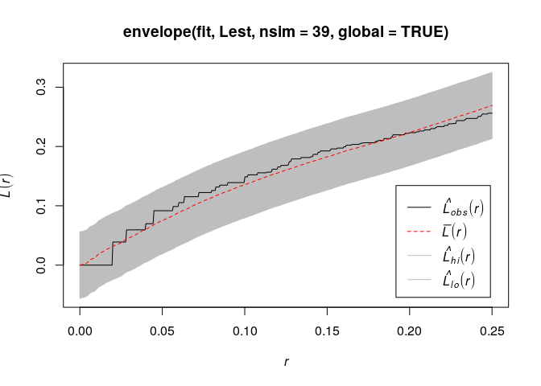<!-- -->
    
    Yes, the model seems plausible and it does not devivate from the
    envelope.

### Exercise 4

1.  Fit a Matern cluster process to the `redwood` data.
    
    We fit the Matern cluster process by specifying the `clusters`
    argument to be `MatClust`.
    
    ``` r
    mfit <- kppm(redwood ~ 1, clusters = "MatClust")
    ```

2.  Use `vcov` to estimate the covariance matrix of the parameter
    estimates.
    
    The variance (covariance matrix) is computed straightforwardly:
    
    ``` r
    vcov(mfit)
    ```
    
        ##             (Intercept)
        ## (Intercept)  0.05304008

3.  Compare with the covariance matrix obtained when fitting a
    homogeneous Poisson model.
    
    ``` r
    vcov(ppm(redwood ~ 1))
    ```
    
        ##             log(lambda)
        ## log(lambda)  0.01612903
    
    As can be seen, the variance of the intensity estimate is quite a
    bit larger in the Matern model. This comes naturally by the doubly
    stochastic construction of the Matern model.

### Exercise 5

In this question we fit a Strauss point process model to the
`swedishpines` data.

1.  We need a guess at the interaction distance
    . Compute and plot
    the -function of the
    dataset and choose the value
     which maximises the
    discrepancy -\\pi r^2|").
    
    We plot the above function which we want to maximize.
    
    ``` r
    plot(Kest(swedishpines), abs(iso - theo) ~ r, main = "")
    ```
    
    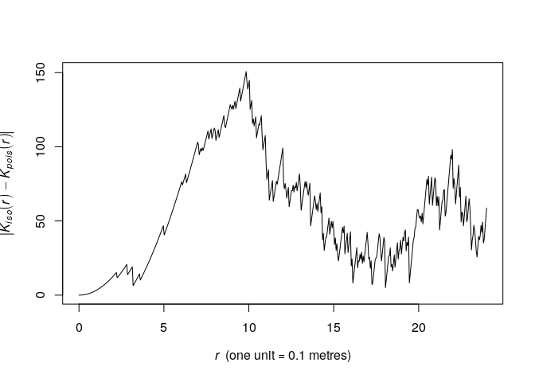<!-- -->
    
    As seen from the plot, the maximum lies around  by
    eye. We find the optimum explicitly like follows:
    
    ``` r
    discrep <- function(r) {
      return(abs(as.function(Kest(swedishpines))(r) - pi*r^2))
    }
    res <- optimise(discrep, interval = c(0.1, 20), maximum = TRUE)
    print(res)
    ```
    
        ## $maximum
        ## [1] 9.84372
        ## 
        ## $objective
        ## [1] 150.6897
    
    ``` r
    R <- res$maximum
    ```
    
    This corresponds nicely with the plot.

2.  Fit the stationary Strauss model with the chosen interaction
    distance using
    
    ``` r
    ppm(swedishpines ~ 1, Strauss(R))
    ```
    
    where `R` is your chosen value.
    
    As we have assigned `R`, we simply write:
    
    ``` r
    fit <- ppm(swedishpines ~ 1, Strauss(R))
    ```

3.  Interpret the printout: how strong is the interaction?
    
    ``` r
    print(fit)
    ```
    
        ## Stationary Strauss process
        ## 
        ## First order term:  beta = 0.08310951
        ## 
        ## Interaction distance:    9.84372
        ## Fitted interaction parameter gamma:   0.2407279
        ## 
        ## Relevant coefficients:
        ## Interaction 
        ##   -1.424088 
        ## 
        ## For standard errors, type coef(summary(x))
    
    As seen, the ![\\gamma =
    \`round(exp(coef(fit)\[2\]), 2)](https://latex.codecogs.com/png.latex?%5Cgamma%20%3D%20%60round%28exp%28coef%28fit%29%5B2%5D%29%2C%202%29
    "\\gamma = \`round(exp(coef(fit)[2]), 2)") parameter is quite small.
    Thus there seems to be a strong negative association between points
    within distance R of each other. A
    
    of  implies the hard
    core process whereas  implies the Poisson process and thus CSR.

4.  Plot the fitted pairwise interaction function using
    `plot(fitin(fit))`.
    
    The pairwise interaction function become:
    
    ``` r
    plot(fitin(fit))
    ```
    
    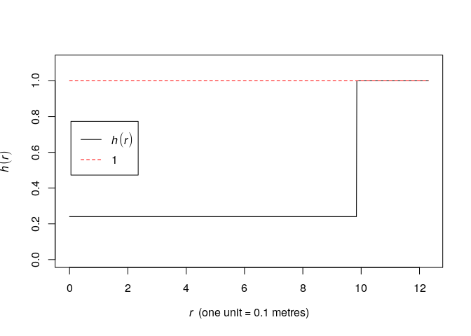<!-- -->

### Exercise 6

In Question 5 we guesstimated the Strauss interaction distance
parameter. Alternatively this parameter could be estimated by profile
pseudolikelihood.

1.  Look again at the plot of the
    -function of
    `swedishpines` and determine a plausible range of possible values
    for the interaction distance.
    
    ``` r
    plot(Kest(swedishpines), main = "")
    ```
    
    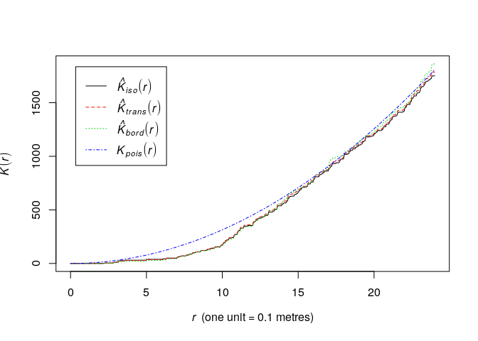<!-- -->
    
    A conservative range of plausible interaction distances seems to be
    5 to 12 meters.

2.  Generate a sequence of values equally spaced across this range, for
    example, if your range of plausible values was
    ![\[0.05, 0.3\]](https://latex.codecogs.com/png.latex?%5B0.05%2C%200.3%5D
    "[0.05, 0.3]"), then type
    
    ``` r
    rvals <- seq(0.05, 0.3, by=0.01)
    ```
    
    We generate the numbers between 5 and 12.
    
    ``` r
    rvals <- seq(5, 12, by = 0.1)
    ```

3.  Construct a data frame, with one column named `r` (matching the
    argument name of `Strauss`), containing these values. For example
    
    ``` r
    D <- data.frame(r = rvals)
    ```
    
    OK,
    
    ``` r
    D <- data.frame(r = rvals)
    ```

4.  Execute
    
    ``` r
    fitp <- profilepl(D, Strauss, swedishpines ~ 1)
    ```
    
    to find the maximum profile pseudolikelihood fit.
    
    OK, let’s execute
        it:
    
    ``` r
    fitp <- profilepl(D, Strauss, swedishpines ~ 1)
    ```
    
        ## (computing rbord)
    
        ## comparing 71 models...
    
        ## 1, 2, 3, 4, 5, 6, 7, 8, 9, 10, 11, 12, 13, 14, 15, 16, 17, 18, 19, 20, 21, 22, 23, 24, 25, 26, 27, 28, 29, 30, 31, 32, 33, 34, 35, 36, 37, 38,
        ## 39, 40, 41, 42, 43, 44, 45, 46, 47, 48, 49, 50, 51, 52, 53, 54, 55, 56, 57, 58, 59, 60, 61, 62, 63, 64, 65, 66, 67, 68, 69, 70,  71.
    
        ## fitting optimal model...
    
        ## done.

5.  Print and plot the object `fitp`.
    
    ``` r
    print(fitp)
    ```
    
        ## profile log pseudolikelihood
        ## for model:  ppm(swedishpines ~ 1,  interaction = Strauss)
        ## fitted with rbord = 12
        ## interaction: Strauss process
        ## irregular parameter: r in [5, 12]
        ## optimum value of irregular parameter:  r = 9.8
    
    ``` r
    plot(fitp)
    ```
    
    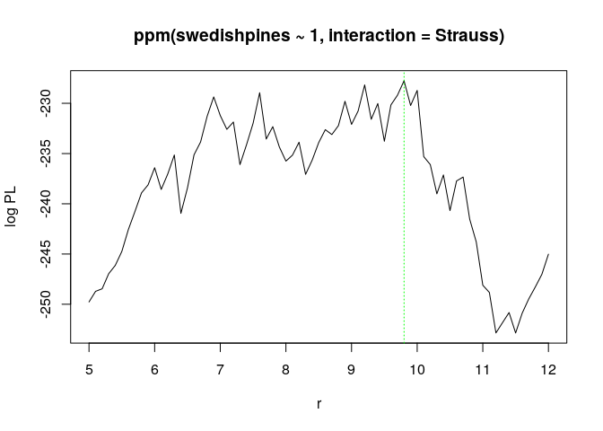<!-- -->

6.  Compare the computed estimate of interaction distance
     with your
    guesstimate. Compare the corresponding estimates of the Strauss
    interaction parameter
    .
    
    ``` r
    (Ropt <- reach(as.ppm(fitp)))
    ```
    
        ## [1] 9.8
    
    The  is consistent with the previous guesstimate.

7.  Extract the fitted Gibbs point process model from the object `fitp`
    as
    
    ``` r
    bestfit <- as.ppm(fitp)
    ```
    
    OK, let’s do that:
    
    ``` r
    bestfit <- as.ppm(fitp)
    ```

### Exercise 7

Modify Question 5 by using the Huang-Ogata approximate maximum
likelihood algorithm (`method="ho"`) instead of maximum pseudolikelihood
(the default, `method="mpl"`).

``` r
fit.mpl <- ppm(swedishpines ~ 1, Strauss(R), method = "mpl")
fit.ho  <- ppm(swedishpines ~ 1, Strauss(R), method = "ho")
```

    ## Simulating... 1, 2, 3, 4, 5, 6, 7, 8, 9, 10, 11, 12, 13, 14, 15, 16, 17, 18, 19, 20, 21, 22, 23, 24, 25, 26, 27, 28, 29, 30, 31, 32, 33, 34, 35, 36, 37, 38,
    ## 39, 40, 41, 42, 43, 44, 45, 46, 47, 48, 49, 50, 51, 52, 53, 54, 55, 56, 57, 58, 59, 60, 61, 62, 63, 64, 65, 66, 67, 68, 69, 70, 71, 72, 73, 74, 75, 76,
    ## 77, 78, 79, 80, 81, 82, 83, 84, 85, 86, 87, 88, 89, 90, 91, 92, 93, 94, 95, 96, 97, 98, 99,  100.
    ## Done.

``` r
print(fit.ho)
```

    ## Stationary Strauss process
    ## 
    ## First order term:  beta = 0.1076896
    ## 
    ## Interaction distance:    9.84372
    ## Fitted interaction parameter gamma:   0.2198154
    ## 
    ## Relevant coefficients:
    ## Interaction 
    ##   -1.514967 
    ## 
    ## For standard errors, type coef(summary(x))

``` r
print(fit.mpl)
```

    ## Stationary Strauss process
    ## 
    ## First order term:  beta = 0.08310951
    ## 
    ## Interaction distance:    9.84372
    ## Fitted interaction parameter gamma:   0.2407279
    ## 
    ## Relevant coefficients:
    ## Interaction 
    ##   -1.424088 
    ## 
    ## For standard errors, type coef(summary(x))

The fits are very similar.

### Exercise 8

Repeat Question 6 for the inhomogeneous Strauss process with
log-quadratic trend. The corresponding call to `profilepl`
    is

``` r
fitp <- profilepl(D, Strauss, swedishpines ~ polynom(x,y,2))
```

    ## (computing rbord)

    ## comparing 71 models...

    ## 1, 2, 3, 4, 5, 6, 7, 8, 9, 10, 11, 12, 13, 14, 15, 16, 17, 18, 19, 20, 21, 22, 23, 24, 25, 26, 27, 28, 29, 30, 31, 32, 33, 34, 35, 36, 37, 38,
    ## 39, 40, 41, 42, 43, 44, 45, 46, 47, 48, 49, 50, 51, 52, 53, 54, 55, 56, 57, 58, 59, 60, 61, 62, 63, 64, 65, 66, 67, 68, 69, 70,  71.

    ## fitting optimal model...

    ## done.

``` r
fitp2 <- profilepl(D, Strauss, swedishpines ~ polynom(x,y,2))
```

    ## (computing rbord)

    ## comparing 71 models...

    ## 1, 2, 3, 4, 5, 6, 7, 8, 9, 10, 11, 12, 13, 14, 15, 16, 17, 18, 19, 20, 21, 22, 23, 24, 25, 26, 27, 28, 29, 30, 31, 32, 33, 34, 35, 36, 37, 38,
    ## 39, 40, 41, 42, 43, 44, 45, 46, 47, 48, 49, 50, 51, 52, 53, 54, 55, 56, 57, 58, 59, 60, 61, 62, 63, 64, 65, 66, 67, 68, 69, 70,  71.

    ## fitting optimal model...

    ## done.

``` r
print(fitp2)
```

    ## profile log pseudolikelihood
    ## for model:  ppm(swedishpines ~ polynom(x,  y,  2),  interaction = Strauss)
    ## fitted with rbord = 12
    ## interaction: Strauss process
    ## irregular parameter: r in [5, 12]
    ## optimum value of irregular parameter:  r = 9.8

``` r
(bestfit <- as.ppm(fitp2))
```

    ## Nonstationary Strauss process
    ## 
    ## Log trend:  ~x + y + I(x^2) + I(x * y) + I(y^2)
    ## 
    ## Fitted trend coefficients:
    ##   (Intercept)             x             y        I(x^2)      I(x * y) 
    ## -5.156605e+00  4.269469e-02  8.582459e-02 -5.324026e-06 -7.955428e-04 
    ##        I(y^2) 
    ## -5.506409e-04 
    ## 
    ## Interaction distance:    9.8
    ## Fitted interaction parameter gamma:   0.2390264
    ## 
    ## Relevant coefficients:
    ## Interaction 
    ##   -1.431181 
    ## 
    ## For standard errors, type coef(summary(x))

``` r
reach(bestfit)
```

    ## [1] 9.8
